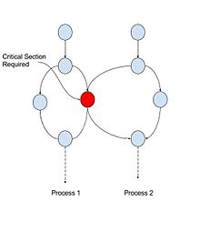

## Introduction
In the paper, "Accelerating Critical Section Execution with Asymmetric
Multi-Core Architectures," the authors, Suleman, Mutlu, Qureshi, and
Patt, essentially concern themselves with the problem popularly revealed
in Amdahl's law,
$$
  \operatorname{speedup}(N) = \frac{1}{1 - P + \frac{P}{N}},
$$
where $\operatorname{speedup}$ is the total execution time of a
single-threaded version of a program divided by the total execution time
an $N$-threaded implementation of the same program.a

Accordingly, the asymptotic speedup of a program as a function of $N$ is
determined by the $1-P$ term, i.e., $\operatorname{speedup}(N)$ goes to
$1/(1-P)$ as $N$ goes to infinity. Thus, even if 99% of the time the
program can be ran in parallel, the maximum possible
$\operatorname{speedup}$ is only $1/(1-0.99) = 100$. Thus, to achieve
scalable performance with increasing thread counts, the sequential
portion of code must be aggressively reduced no matter how *small* it
is.

## Accelerated Critical Sections (ACS)
The authors point out that a common occurrence of thread serialization
is caused by the presence of *critical sections*, defined as code blocks
guarded by locks to enforce *mutual exclusion*.

To mitigate the effect of critical section serialization (see Figure
\@ref(fig:cs-fig)), they propose Accelerated Critical Sections (ACS).
Specifically, using an asymmetric multi-core processor in which one of the cores
is four times the size of the other cores, use the large core to quickly execute
critical sections on behalf of the smaller cores.

```{r cs-fig,fig.cap = "Critical section", echo=F}

```


## Trade-offs
There are several key performance trade-offs with respect to ACS.

### Trade-off #1
Faster critical section execution versus fewer threads. That is, the large core
takes up an area equivalent to 4 small cores; therefore, fewer cores are
available for thread execution. However, there are two forces which conspire to
mitigate this disadvantage.

First, as the transistor budget increases, the marginal
cost of replacing multiple small cores with a single large core
decreases. For example, suppose we have an area budget of 32 small
cores. We can use that budget to either make a system with 32 small
cores, or alternatively a system with 1 large core and 28 small cores.
The system with the large core case has (not counting the large core in
this fraction since it can only be used to dispatch critical sections)
the number of cores compared to the system with 32 small cores.
This is much more favorable than if we only had an area budget of 8
small cores.

Second, as critical section contention grows, increasing
thread counts provide diminishing (or even negative) returns. Contention
tends to grow in line with increasing core counts therefore trading
multiple small cores for a single large core becomes a better deal as
the transistor budget increases. In general, ACS may only improve
performance if the gain in executing critical sections faster on the
large core overcomes the advantage of having more threads which becomes
ever more likely with increasing transistor budgets.

### Trade-off #2
Cache misses caused by private data as opposed
to cache misses caused by shared data. In particular, if private data on
a small core is referenced inside the critical section, then that data
needs to be transferred from the small core to the large core3. However,
critical sections frequently access shared memory, thus if we usually
only execute code that accesses shared memory with the large core, that
will lead to improved cache utilization (reduced cache misses) when
accessing shared memory.In general, if accessing shared data is more
common than accessing private data in a critical section--which is not
unlikely--then the trade-off tips in favor of ACS.

### Trade-off #3
The communications overhead incurred by having the large
core execute a critical section on behalf of a small core. In particular, when a
thread on a small core encounters a critical section, it issues a
request to the large core to execute the specified critical section.
When the large core receives this request, it is placed on a queue
(Critical Section Request Buffer--CSRB) and executed by the large core
when it reaches the top. This communication overhead is avoided if the
critical section is simply executed on the local small core. However,
this overhead may mitigated by the fact that if multiple cores are
trying to read or write a shared lock, then the overhead of having to
synchronize on this lock (e.g., propagating the lock's state to remote
caches when it changes) can be significant. If the lock is usually only
accessed by the large core then the need to synchronize the state of the
lock is reduced (fewer cache misses).

### Trade-off #4
If a program has many disjoint critical sections, where each critical section
can be accessed by multiple threads simultaneously without contention, then
executing them exclusively on the large core will cause them to unnecessarily
execute sequentially; this is what the authors call "false serialization." To
mitigate this issue, they propose adding additional circuitry to
heuristically estimate whether a critical section is being falsely
serialized.

The estimation uses the following quantification: count the
number of requests in the CSRB for which the lock address for the
enqueued request's critical section is different from the lock address
for the incoming request's critical section. If the count is greater
than one, there are at least two independent critical sections already
waiting to be executed in the CSRB. Add this count to a counter for the
incoming lock address.

Alternatively, if the count is only one, then
decrement the lock address' counter. If a counter reaches a maximum
threshold, the ACS is disabled for that lock address. Thus when a thread
happens upon that lock, it will try to acquire it and execute the
critical section locally. The hope is the false serialization rate is
not so high that it overcomes the benefit of faster critical section
execution.

## Comparison: ACS vs SCMP
With the above trade-offs in mind, the authors set out to see how
their proposed ACS system compares to two other kinds of systems: a
symmetric CMP (SCMP), a multi-core processor in which each core is
uniform, and an asymmetric CMP (ACMP), a multi-core processor in which
one of the cores is larger like in the ACS system except that the ACMP
system's large core is not used for accelerating critical sections.

To compare these systems, they compare their respective execution times on
a carefully chosen benchmark suite. To make the comparison fair, they
must control for any hardware differences that may lead to one system
having an advantage for reasons unrelated to their ACS framework, e.g.,
use identical cores (with a few exceptions since the ACS requires
hardware support), memory configurations, transistor budgets, and so
forth.

To control for this, they simulate each system in software rather
than real silicon and provide them approximately identical designs and
constraints. On each system (ACS, SCMP, and ACMP), they run the same
benchmark 4 suite on different area budgets (in units of "small-cores"),
e.g., in benchmarks ran on systems with a budget of 8 small cores, the
SCMP system consists of 8 small cores and the ACMP and ACS systems
consist of 4 small cores and one large core.

They expect that, for
reasons related to the previously mentioned trade-offs (e.g., decreasing
marginal costs), as the area budget increases they will see a gradual
improvement in the ACS systems compared to the SCMP and ACMP systems.

Additionally, the benchmark suite can be divided into two broad
categories: programs that use coarse-grained locking, 10 critical
sections or less, and programs that use fine-grained locking. The two
categories stress different aspects of the previously mentioned
trade-offs, and they expect that their ACS system will compare more
favorably in coarse-grained locking benchmarks (fine-grained locking
reduces critical section contention, so benefits from ACS are reduced).

On the course-grained benchmarks, the ACS system generally compares
better than the other two even when the area budget is only 8 small
cores; it wins five out seven of the benchmarks.

One of the benchmarks
it compares less favorably in is a parallelized implementation of
quicksort. Quicksort experiences very little contention on critical
sections (and thus benefits from higher thread counts) and also
frequently accesses private data (which must be transferred to the ACS's
large core).

However, as the area budget increases ACS compares more
favorably. Indeed, on systems with an area budget of 32 small cores, the
ACS system significantly improves performance by 42% compared to SCMP
and by 31% compared to ACMP. On the fine-grained benchmarks, as the
authors expected the ACS system compares less favorably.

On systems with
an area budget only 8 small cores, ACS reduces execution time on average
by 20% compared to ACMP but increases execution time by a significant
37% compared to SCMP. Critical section contention was so low that SCMP
was able to take effective advantage of its larger core count. However,
as the area budget scales up, critical section contention should
increase and the ACS system gains some lost ground.

Indeed, when the
area budget reaches 32, ACS outperforms SCMP by 17% and ACMP by 13%. In
addition, on many of the benchmarks performance on ACS scaled more
consistently with core quantity than on SCMP and ACMP. For instance, on
the SCMP system it was usually necessary to reduce the optimal thread
count to something well below the total number of cores to prevent
critical section contention from degrading performance, but with the ACS
system improvement would often be seen up to the maximum of 32 cores
with room for growth.

## Conclusion
ACS outperforms both SCMP and ACMP on all
representative (coarse-grained and fine-grained) critical-section
benchmarks on processors with 16 or more cores, and it even performs
well on more modest processors (especially in the coarse-grained
benchmarks). In light of this and the reasonable argument that ACS will
continue to extend its lead as core counts and critical-section
contention rise hand in hand, ACS is a promising area of future
development.
