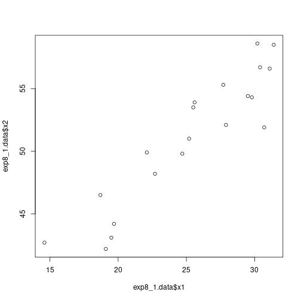

# Problem 1

We are interested in modeling the relationship among the predictor variables for the body fat example. Specifically, we wish to model midarm circumference ($w$) as a function of triceps skinfold thickness ($x_1$) and thigh circumference ($x_2$). Refer to the data from Table 7.1. The data for $x_1$ is listed in the first column, $x_2$ is listed in the second column, and $w$ is listed in the third column. We are not interested in the body fat measurements, listed in the fourth column, for this problem.

## Part (a)
> Compute the correlation matrix for $w$, $x_1$, $x_2$.


``` r
# drop the last column of data (original response variable in the experiment)
exp8_1.data = read.csv('TABLE0701.csv')[,1:3]
exp8_1.data.cor = cor(exp8_1.data)
print(exp8_1.data.cor)
```

```
##           triceps     thigh    midarm
## triceps 1.0000000 0.9238425 0.4577772
## thigh   0.9238425 1.0000000 0.0846675
## midarm  0.4577772 0.0846675 1.0000000
```

## Part (b)
> Test for a marginal effect of $x_2$ on $w$ against a model which includes no other input variables. (Compute the test statistic and $p$-value.) Provide an interpretation of the result, stated in the context of the problem.

We test for a marginal effect of $x_2$ on $w$ by comparing the effects model
$m_2$ with the no effects models $m_0$ where
$$
m_0 : w_i = \beta_0 + \epsilon_i
$$
and
$$
m_2 : w_i = \beta_0 + \beta_1 x_{2 i} + \epsilon_i.
$$


``` r
names(exp8_1.data) = c("x1","x2","w")
m0 = lm(w~1,  data=exp8_1.data)
m2 = lm(w~x2, data=exp8_1.data)
print(anova(m0,m2))
```

```
## Analysis of Variance Table
## 
## Model 1: w ~ 1
## Model 2: w ~ x2
##   Res.Df    RSS Df Sum of Sq    F Pr(>F)
## 1     19 252.73                         
## 2     18 250.92  1    1.8117 0.13 0.7227
```

We see that $F_2 = .130$ with $p$-value $.723$.

This is a very large $p$-value, and so $x_2$ (thigh) is not adding much
explanatary power compared to the model $m_0$ with no explanatary inputs. In
other words, $x_2$ provides very little predictive power of $w$ (midarm).

### Interpretation

The observed data is compatible with the reduced (no effects) model $m_0$. It is not necessary to add thigh measurement to the no effects model for predicting midarm measurment.

## Part (c)
> Test for a partial effect of $x_2$ on $w$ against a model which includes $x_1$. (Compute the test statistic and $p$-value.) Provide an interpretation of the result, stated in the context of the problem.

We test for a partial effect of $x_2$ on $w$ given that $x_1$ is already in the model by comparing models $m_1$ and $m_{1 2}$ where
$$
m_1 : w_i = \beta_0 + \beta_1 x_{i 1} + \epsilon_i
$$
and
$$
m_{1 2} : w_i = \beta_0 + \beta_1 x_{i 1} + \beta_1 x_{2 i} + \epsilon_i.
$$


``` r
m1 = lm(w~x1, data=exp8_1.data)
m12 = lm(w~x1+x2, data=exp8_1.data)
print(anova(m1,m12))
```

```
## Analysis of Variance Table
## 
## Model 1: w ~ x1
## Model 2: w ~ x1 + x2
##   Res.Df     RSS Df Sum of Sq      F    Pr(>F)    
## 1     18 199.769                                  
## 2     17   2.416  1    197.35 1388.6 < 2.2e-16 ***
## ---
## Signif. codes:  0 '***' 0.001 '**' 0.01 '*' 0.05 '.' 0.1 ' ' 1
```

## Part (d)
> Fit the regression model for $w$ which includes both $x_1$ and $x_2$.


``` r
summary(m12)
```

```
## 
## Call:
## lm(formula = w ~ x1 + x2, data = exp8_1.data)
## 
## Residuals:
##      Min       1Q   Median       3Q      Max 
## -0.58200 -0.30625  0.02592  0.29526  0.56102 
## 
## Coefficients:
##             Estimate Std. Error t value Pr(>|t|)    
## (Intercept) 62.33083    1.23934   50.29   <2e-16 ***
## x1           1.88089    0.04498   41.82   <2e-16 ***
## x2          -1.60850    0.04316  -37.26   <2e-16 ***
## ---
## Signif. codes:  0 '***' 0.001 '**' 0.01 '*' 0.05 '.' 0.1 ' ' 1
## 
## Residual standard error: 0.377 on 17 degrees of freedom
## Multiple R-squared:  0.9904,	Adjusted R-squared:  0.9893 
## F-statistic: 880.7 on 2 and 17 DF,  p-value: < 2.2e-16
```

We estimate
$$
\hat{w} = 62.331 + 1.881 x_1 - 1.608 x_2.
$$


``` r
plot(exp8_1.data$x1,exp8_1.data$x2)
```



## Part (e)
> What feature of multidimensional modeling is illustrated in this problem?

Answer: **Multicollinearity**.

Specifically, observe that $x_1$ and $x_2$ are strongly positively correlated, $r\_{1 2} = 0.924$, but $x_1$ and $x_2$ have, respectively, a positive and negative partial effect on $w$. The combination of these partial effects and the correlation of $x_1$ and $x_2$ cancels out their partial effects on $w$.

If we look at the scatterplots of $x_1$ versus $w$ and $x_2$ vs $w$, they seem uncorrelated. However, the joint distribution of $x_1$ and $x_2$ are highly explanatory of $w$. Investigating relationships in higher dimensions requires higher level statistical methods, such as regression analysis, rather than two-dimensional methods and graphs.
