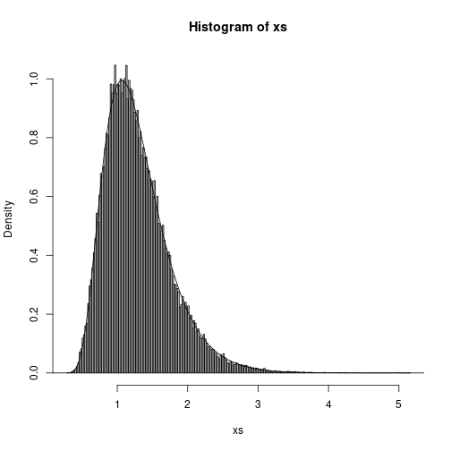
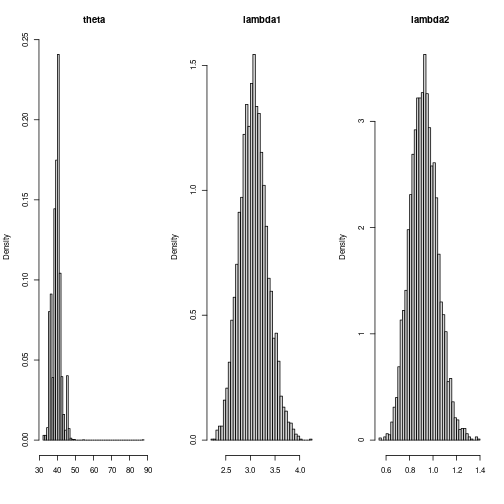
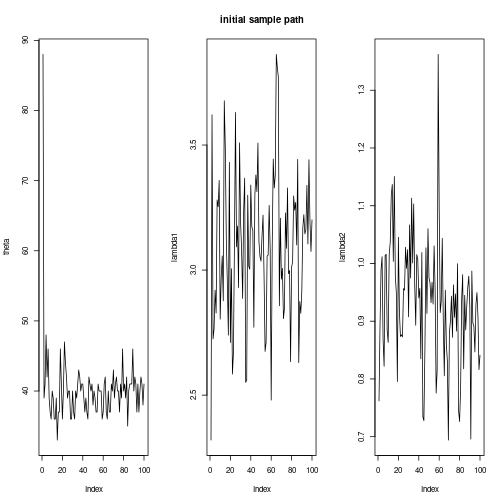
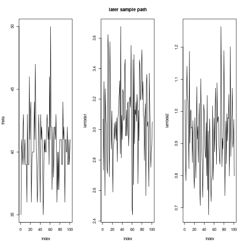
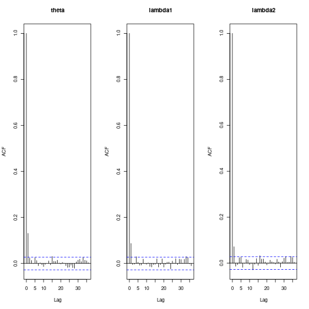

# Problem 1
Consider finding $\sigma^2 = E(X^2)$ when $X$ has the density that is proportional to
$$
  q(x) = \frac{e^x}{e^{2x}+1}, x \in (-\infty,\infty).
$$

## Part (a)
Find the Monte Carlo estimate of $\sigma^2$ using acceptance-rejection sampling. Take the candidate distribution as the double exponential, i.e., $g(x) = \exp(-|x|)$.

### Solution

We are interested in sampling $X$ from a kernel $q$.

``` r
q <- function(x) { exp(x)/(exp(2*x)+1) }
```

Suppose $Y$ is the double exponential random variable with the kernel $g$.

``` r
g <- function(x) { exp(-abs(x)) }
```

Since the double exponential is symmetric about its mean $0$, we can simply sample $W \sim \mathrm{EXP}(\lambda=1)$ and let $Y = -W$ with probability $0.5$ and $Y = W$ with probability $0.5$.


``` r
ry <- function(n)
{
  ys <- numeric(n)
  ws <- rexp(n=n,rate=1)
  us <- runif(n)
  for (i in 1:n) { ys[i] <- ifelse(us[i] < 0.5,-ws[i],ws[i]) }
  ys
}
```

To find the constant $c$ such that $f(x)/c g(x) \leq 1$, we solve
$$
\begin{align*}
  c &= \max_x \left\{\frac{q(x)}{g(x)}\right\}\\
    &= \max_x \left\{\frac{e^{x+|x|}}{e^{2x}+1}\right\}.
\end{align*}
$$
We forgo a formal proof and point out that the denominator is always larger than the numerator, i.e., $q(x)/g(x) < 1$. However, as $x$ goes to $\pm \infty$, $q(x)/g(x)$ goes to $1$ and thus $c = 1$. We implement the acceptance-rejection sampler for $X$ with kernel $q$ with:

``` r
rx <- function(n)
{
  xs <- numeric(n)
  for (i in 1:n)
  {
    repeat
    {
      y <- ry(1)
      if (runif(1) < q(y)/g(y))
      {
        xs[i] <- y
        break
      }
    }
  }
  xs
}
```

We estimate $E(X^2)$ by taking the square of a sample:

``` r
x <- rx(10000)
print(mean(x^2))
```

```
## [1] 2.43841
```

## Part (b)
Find the normalizing constant of the pdf by integrating $q(x)$ over the support. Then derive the CDF of $X$.

### Solution
The normalizing constant is given by solving for $Z$ in
$$
  \frac{1}{Z} \int_{-\infty}^{\infty} q(x) dx = 1.
$$

Let $u = e^x$, then $du = e^x dx$, $e^{2x} = (e^{x})^2 = u^2$, and by symmetry about $0$,
$$
  Z = 2 \int_{1}^{\infty} \frac{1}{1+u^2} du.
$$

The antiderivative is just $\mathrm{arctan}(u)$, and thus
$$
  Z = 2 (\mathrm{arctan}(\infty) - \mathrm{arctan}(1))
$$

Since $\tan y = \sin y / \cos y = x$, as $y \to \pi/2$, $x \to \infty$, that means that $\mathrm{arctan}(x) \to \pi/2$ as $x \to \infty$.
Furthermore, $\tan(x)=1$ when $x=\pi/4$, thus
$$
  Z = 2 (2\pi/4 - \pi/4) = 2(\pi/4) = \pi/2.
$$

We verify with a numerical integrator:

``` r
right_riemann_sum <- function(f, a, b, n)
{
  h <- (b-a)/n
  h*sum(f(a + (1:n)*h))
}
```

When we apply the numerical integrator to the kernel $q$ and subtract $\pi/2$ we obtain a result that is approximately $0$, confirming our earlier calculation:

``` r
right_riemann_sum(q,-10,10,1000) - pi/2
```

```
## [1] -9.080289e-05
```

Thus, the density of $X$ is given by
$$
  f(x) = \frac{2}{\pi} \frac{e^x}{e^{2x}+1}.
$$

The cdf of $X$ is thus given by
$$
  F(x) = \int_{-\infty}^{x} f(s) ds = \frac{2}{\pi} (\mathrm{arctan}(e^x) - \mathrm{arctan}(0))
$$
which simplifies to
$$
  F(x) = \frac{2}{\pi} \mathrm{arctan}(e^x).
$$


``` r
pdf <- function(x) { 2/pi * q(x) }
cdf <- function(x) { 2/pi * arctan(exp(x)) }
```


## Part (c)
Generate a sample of $X$ using inverse transform method and find the Monte Carlo estimate of $\sigma^2$.

### Solution

To apply the inverse transform method, we solve for $x$ in $p = F(x)$,
$$
\begin{align*}
  p                                 &= \frac{2}{\pi} \mathrm{arctan}(e^x)\\
  \frac{\pi}{2} p                   &= \mathrm{arctan}(e^x)\\
  \tan\left(\frac{\pi}{2} p\right)  &= e^x\\
  x                                 &= \log\left(\tan\left(\frac{\pi}{2} p\right)\right).
\end{align*}
$$

Thus, a sampler for $X$ is given by
$$
  X = \log\left(\tan\left(\frac{\pi}{2} U\right)\right)
$$
where $U \sim \mathrm{UNIF}(0,1)$.


``` r
rx.transform <- function(n)
{
  us <- runif(n)
  log(tan(pi/2*us))
}
```

We estimate $\sigma^2$ with:

``` r
x <- rx.transform(10000)
print(mean(x^2))
```

```
## [1] 2.508885
```

## Part (d)
Repeat the estimation using importance sampling with standardized weights.

### Solution

``` r
#' importance sampling
#'
#' estimates E{h(X)} by taking n sample points from g and then taking a
#' weighted mean using the standardized weights.
rx.importance <- function(n,h)
{
  w = function(x) {
     out <- q(x)/g(x)
     out/sum(out)
  }

  ys <- ry(n)
  sum(w(ys)*h(ys))
}
```

We apply the procedure to $h(x) = x^2$ to estimate $E(h(X))$:

``` r
print(rx.importance(10000,function(x) { x^2} ))
```

```
## [1] 2.437009
```

# Problem 2
Consider the inverse Gaussian distribution with density
$$
  f(x|\theta_1,\theta_2) \propto x^{-1.5} \exp\left\{-\theta_1 x - \frac{\theta_2}{x} + \psi(\theta_1,\theta_2)\right\}
$$
where $\psi(\theta_1,\theta_2) = 2\sqrt{\theta_1\theta_2} + \log(2\theta_2)$.
Estimate $E(X)$ using MCMC. You may take the proposal distribution as a
$\mathrm{Gamma}(\sqrt{\theta_2/\theta_1},1)$.

## Solution

Here is our implementation of the Metropolis-Hastings algorithm:

``` r
# A sampling procedure from the pdf f using Metropolis-Hastings algorithm
rf <- function(n, theta1, theta2, burn=0)
{
    g <- function(x) { dgamma(x,shape=sqrt(theta2/theta1),rate=1) }
    rg <- function(n) { rgamma(n,shape=sqrt(theta2/theta1),rate=1) }
    ker <- function(x) { x^(-1.5)*exp(-theta1*x-theta2/x) }
  
    m <- n + burn
    xs <- vector(length = m)
    xs[1] <- rg(1)
    
    for (i in 2:m) {
        v <- rg(1)
        u <- xs[i-1]
        R <- ker(v) * g(u) / (ker(u) * g(v))
        if (runif(1) <= R) { xs[i] <- v }
        else { xs[i] <- u }
    }
    xs[(burn+1):m]
}
```

We apply the algorithm to $\theta_1 = 5$ and $\theta_2 = 3$:

``` r
n <- 100000
theta1 <- 3
theta2 <- 5
xs <- rf(n,theta1,theta2,burn=20000)
```

Now, we estimate $E(X)$ with:

``` r
print(mean(xs))
```

```
## [1] 1.28597
```

We have deduced that the true mean is given by $\mu = \sqrt{\theta_2/\theta_1}$, and so we see the algorithm provides a reasonable estimation.

We would like to plot the histogram with the density superimposed on top of it. So, we implement the density function with:

``` r
f.make <- function(theta1,theta2)
{
  k <- function(x) { x^(-1.5) * exp(-theta1*x - theta2/x) }
  Z <- right_riemann_sum(k,0,20,10000)
  function(x) { k(x) / Z }
}
f <- f.make(theta1,theta2)
hist(xs,breaks=200,freq=F)
ps <- seq(0,10,by=.01)
lines(x=ps,y=f(ps))
```



# Problem 3
Consider the data on coal-mining disasters from 1851 to 1962 (coal.txt data on blackboard). The rate of accidents per year appears to decrease around 1900, so we consider a change-point model for these data. Let $X_j$ be the number of accidents in year $j$. $X_j \sim \mathrm{Poisson}(λ_1)$, $j = 1, \ldots, θ$, and $X_j \sim \mathrm{Poisson}(λ_2)$, $j = θ + 1, \ldots, 112$. The change-point occurs after the $θ$-th year in the series. This model has parameters are $θ, λ_1, λ_2$. Below are three sets of priors for a Bayesian analysis of this model. Assume prior $λ_i \sim \mathrm{Gamma}(3, 1)$ for $i = 1, 2$, and assume $θ$ follows a discrete uniform distribution over $\{1, \ldots, 111\}$.

## Part (a)
Derive the posterior distribution of $(θ, λ_1, λ_2)$.

### Solution
First, we derive the distribution of $X_i|(\lambda_1,\lambda_2,\theta)$,
$$
  X_i \sim f(x_i | \lambda_1,\lambda_2,\theta)
$$
where
$$
  f(x_i | \lambda_1,\lambda_2,\theta) =
     \frac{\lambda_1^{x_i} e^{-\lambda_1}}{x_i!} I(i \leq \theta) +
     \frac{\lambda_2^{x_i} e^{-\lambda_2}}{x_i!} I(i > \theta).
$$
Thus, the likelihood is
$$
  L(\lambda_1,\lambda_2,\theta|\vec{x}) =
    \prod_{i=1}^{\theta} \frac{\lambda_1^{x_i} e^{-\lambda_1}}{x_i!}
    \prod_{\theta+1}^{n} \frac{\lambda_2^{x_i} e^{-\lambda_2}}{x_i!}
$$
which up to proportionality of the parameters may be written as
$$
  L(\lambda_1,\lambda_2,\theta|\vec{x}) \propto
    \lambda_1^{t(\theta)} e^{-\theta \lambda_1}
    \lambda_2^{t(n)-t(\theta)} e^{-(n-\theta) \lambda_2}.
$$
where $t(\theta) = \sum_{i=1}^{\theta} x_i$.

The posterior distribution is given by
$$
  f(\theta,\lambda_1,\lambda_2|\vec{x}) = f(\vec{x}|\theta,\lambda_1,\lambda_2)f(\theta,\lambda_1,\lambda_2)/f(\vec{x})
$$
which up to proportionality may be rewritten as
$$
  f(\theta,\lambda_1,\lambda_2|\vec{x}) \propto L(\theta,\lambda_1,\lambda_2|\vec{x})f(\theta)f(\lambda_1)f(\lambda_2).
$$
where $f(\theta) \propto I(0 \leq \theta < n)$ and $f(\lambda_j) \propto \lambda_j^2 \exp(-\lambda_j)$.

We are given the priors $\lambda_j \sim \mathrm{GAM}(3,1)$, and thus
$$
  f(\lambda_j) \propto \lambda_j^2 e^{-\lambda_j}.
$$

Putting it all together, the posterior distribution is given by
$$
  f(\theta,\lambda_1,\lambda_2|\vec{x}) \propto
    \lambda_1^{t(\theta)} e^{-\theta \lambda_1}
    \lambda_2^{t(n)-t(\theta)} e^{-(n-\theta) \lambda_2} \lambda_1^2 e^{-\lambda_1} \lambda_2^2 e^{-\lambda_2}
$$
where $t(\theta) = \sum_{i=1}^{\theta} x_i$, $1 \leq \theta < n$, and $\lambda_1,\lambda_2 > 0$.

## Part (b)
Derive the conditional posterior distributions necessary to carry out Gibbs sampling for this change-point model.

### Solution

First, we find the conditional posterior distribution for $\lambda_1$ by
simply dropping those factors in the posterior that are not a function of $\lambda_1$,
$$
  f(\lambda_1|\theta,\lambda_2,\vec{x}) \propto \lambda_1^{t(\theta) + 2} e^{-(\theta+1) \lambda_1},
$$
which is the kernel for $\mathrm{GAM}(t(\theta)+1,\theta+1)$,
$$
  \lambda_1 \sim \mathrm{GAM}(t(\theta)+1,\theta+1).
$$

Next, we find the conditional posterior distribution for $\lambda_2$ using
the same argument,
$$
  f(\lambda_2|\theta,\lambda_1,\vec{x}) \propto
    \lambda_2^{t(n)-t(\theta)+2} e^{-(n-\theta+1) \lambda_2},
$$
which is the kernel for $\mathrm{GAM}(t(n)-t(\theta)+1,n-\theta+1)$,
$$
  \lambda_2 \sim \mathrm{GAM}(t(n) - t(\theta) + 1,n-\theta+1).
$$

Finally, we find the conditional posterior distribution for $\theta$. First, we drop factors that are not a function of $\theta$,
$$
  f(\theta|\lambda_1,\lambda_2,\vec{x}) \propto
    \lambda_1^{t(\theta)} e^{-\theta \lambda_1}
    \lambda_2^{-t(\theta)} e^{\theta \lambda_2}.
$$

Simplifying,
$$
  f(\theta|\lambda_1,\lambda_2,\vec{x}) \propto
    \left(\frac{\lambda_1}{\lambda_2}\right)^{t(\theta)} e^{(\lambda_2 - \lambda_1) \theta} I(\theta \in \{1,\ldots,n-1\}),
$$
which is the kernel of a probability mass function parameterized by $\lambda_1$ and $\lambda_2$.

To generate random variates from the conditional posterior of $\theta$,
we sample from $\{1,\ldots,n-1\}$ where $\theta=k$ is realized
with probability $f(k|\lambda_1,\lambda_2,\vec{x})$. Algorithmically, let $U \sim \mathrm{UNIF(0,1)}$ and then $\theta$ realizes
$k$ if
$$
  \sum_{\theta=1}^{k-1} f(\theta|\cdot) < U \leq \sum_{\theta=1}^{k} f(\theta|\cdot).
$$

### Additional analysis
Note that $\theta$ has a prior that only assigns non-zero values to $\theta \in \{1,\ldots,n-1\}$
where $n=112$ (there are $112$ data rows in the ``coal.txt'' data file). Thus,
given a prior that assigns $0$ probability to the outcome $\theta=n$, the
conditional posterior distribution for $\theta$ also assigns zero
probability to $\theta=n$. Intuitively, it makes sense that no amount of
evidence is sufficient to overcome a prior of zero probability.

Furthermore, recall that $\theta$ is the change-point. If the change-point occurs at $\theta=n$, then in fact there was no change-point and $X_i \sim \mathrm{POI}(\lambda_1)$ for $i=1,\ldots,n$.
In other words, assigning $\theta=n$ a prior probability of $0$ is equivalent to claiming there is a change point.

We may generalize this so that if we are given prior information that
$\theta \notin \mathbb{K}$, we may assign zero probability to that event
in the prior, i.e., $\sum_{k \in \mathbb{K}} f_{\theta}(k) = 0$.
Of course, we may assign a non-uniform prior over the support, as well.
The posterior distribution $f_{\theta|\cdot}$ from a previous experiment
is a likely candidate for such a prior.

## Part (c)
Implement the Gibbs sampler. Use a suite of convergence diagnostics to evaluate the convergence and mixing of your sampler.

### Solution

We load the data with:

``` r
x <- read.table("coal.txt",header=T)[,2]
N <- length(x)
```

We implement the conditional samplers with:

``` r
t <- function(theta) { sum(x[1:theta]) }
rlambda1 <- function(n,theta) { rgamma(n,t(theta)+1,theta+1) }
rlambda2 <- function(n,theta) { rgamma(n,t(N)-t(theta)+1,N-theta+1) }

ktheta <- Vectorize(function(theta,lambda1,lambda2)
{
  if (theta < 1 || theta >= N) { return(0) }  
  (lambda1/lambda2)^t(theta)*exp(theta*(lambda2-lambda1))
},"theta")

ptheta <- function(theta,lambda1,lambda2)
{
  Z <- sum(ktheta(1:(N-1),lambda1,lambda2))
  ktheta(theta,lambda1,lambda2)/Z
}

rtheta = function(n,lambda1,lambda2)
{ 
  sample(x=1:(N-1),n,replace=T,prob=ptheta(1:(N-1),lambda1,lambda2)) 
}

rlambda1.prior <- function() { rgamma(1,shape=3,rate=1) }
rlambda2.prior <- function() { rgamma(1,shape=3,rate=1) }
rtheta.prior <- function() { sample(1:(N-1),1,replace=T) }
```

We implement the Gibbs sampling with:

``` r
gibbs <- function(n,burn=1000)
{
  nn <- n+burn
  thetas <- matrix(nrow=nn,ncol=3)
  thetas[1,] <- c(rtheta.prior(),rlambda1.prior(),rlambda2.prior())
  
  for (i in 1:(nn-1))
  {
    theta.new <- rtheta(1,thetas[i,2],thetas[i,3])
    lambda1.new <- rlambda1(1,theta.new)
    lambda2.new <- rlambda2(1,theta.new)
    thetas[i+1,] <- c(theta.new,lambda1.new,lambda2.new)
  }

  thetas <- thetas[(burn+1):nn,]
  theta.est <- mean(thetas[,1])
  lambda1.est <- mean(thetas[,2])
  lambda2.est <- mean(thetas[,3])
  list(theta.dist=thetas,
       theta.est=theta.est,
       lambda1.est=lambda1.est,
       lambda2.est=lambda2.est)
}
```


``` r
n <- 5000
burn <- 0
res <- gibbs(n,burn)
param.est <- c(res$theta.est,res$lambda1.est,res$lambda2.est)
names(param.est) <- c("theta","lambda1","lambda2")
knitr::kable(data.frame(param.est))
```


|        |  param.est|
|:-------|----------:|
|theta   | 40.0884000|
|lambda1 |  3.0650183|
|lambda2 |  0.9216624|

Now, we plot the marginals for the estimator.


``` r
par(mfrow=c(1,3))
hist(res$theta.dist[,1],freq=F,main="theta",xlab="",breaks=50)
hist(res$theta.dist[,2],freq=F,main="lambda1",xlab="",breaks=50)
hist(res$theta.dist[,3],freq=F,main="lambda2",xlab="",breaks=50)
```



``` r
plot(res$theta.dist[1:100,1],type="l",main="",ylab="theta")
plot(res$theta.dist[1:100,2],type="l",main="initial sample path",ylab="lambda1")
plot(res$theta.dist[1:100,3],type="l",main="",ylab="lambda2")
```



``` r
plot(res$theta.dist[2000:2100,1],type="l",main="",ylab="theta")
plot(res$theta.dist[2000:2100,2],type="l",main="later sample path",ylab="lambda1")
plot(res$theta.dist[2000:2100,3],type="l",main="",ylab="lambda2")
```



``` r
acf(res$theta.dist[,1],main="theta")
acf(res$theta.dist[,2],main="lambda1")
acf(res$theta.dist[,3],main="lambda2")
```



They all satisfy normality (approximately symmetric around the mean),
converge quickly, exhibit low autocorrelation (ACF decays quickly),
and show good support (they vigorously jiggle around the mean).

# Problem 4
Compare bootstrapped CIs for the population 90th percentile to the large sample estimate as in the notes for (a) $\mathrm{EXP}(1)$ data,
(b) $N(0,1)$ data, (c) $U(0, 1)$ data, and (d) $\chi^2(1)$ data.
For sample sizes of $n = 100$ and replicate $B = 500$.

## Solution

Suppose we have a sample $\{X_i\} i.i.d. F$ where $F$ is the cdf.
An estimate of $F$ is given by
$$
  F_n(x) = \frac{1}{n} \sum_{i=1}^{n} I(x_i \leq x).
$$

Assuming $F$ is continuous, the $p$-th \emph{quantile} of a distribution $F$ is given by
$$
  q = F^{-1}(p)
$$
which may be estimated with $q_n = F^{-1}_n(p) = x_{[n p]}$.

## Delta method
Asymptotically,
$$
  q_n \sim \mathrm{AN}\left(q, \frac{p(1-p)}{n f^2(q)}\right).
$$

Since the pdf $f$ is not known, we must estimate it with $f_n$ (note that we cannot simply take the derivative of $F_m$ since it is a step function). We use the built-in R function $\mathrm{density}$ to estimate $f$.

Using the asymptotic normality, we see that the variance of our estimator
$q_n$ may be estimated as
$$
  \mathrm{Var}(q_n) = \frac{p(1-p)}{n f_n^2(q)}
$$
and thus an $(1-\alpha) \times 100\%$ confidence interval is given by
$$
  q_n \pm z_{1-\alpha/2} \sqrt{\frac{p(1-p)}{n f_n^2(q_n)}}.
$$

We implement the confidence interval estimator for $q_n$ with the following:

``` r
q.ci.delta <- function(samp,p,alpha,bw="bcv")
{
  z <- qnorm(1-alpha/2)
  q.est <- quantile(samp,p)
  f <- density(samp,bw=bw,n=1,from=q.est,to=q.est)$y
  se <- sqrt(p*(1-p)/(n*f^2))
  list(estimate=q.est,p=p,alpha=alpha,ci=c(q.est-z*se,q.est+z*se))
}
```

## Bootstrap method
Next, we consider the Bootstrap method. The statistic for the Bootstrap method, the $p$-th quantile, is given by:

``` r
# p-quantile statistic that we provide as input to the
# bootstrap function
q.stat <- function(p=0.9)
{
  function(x,indices)
  {
    f <- quantile(x[indices],p)
    names(f) <- NULL
    f
  }
}
```

We implement the Bootstrap confidence interval estimator for $q_n$ with the following:

``` r
q.ci.bs <- function(samp,p,alpha,B)
{
  library(boot)
  b <- boot(samp, q.stat(p), B)
  ci <- boot.ci(b,conf=1-alpha,type="perc")$percent
  list(estimate=quantile(samp,p),p=p,alpha=alpha,ci=c(ci[4],ci[5]))
}
```

We simply sample from the empirical distribution (resample the observed sample) and apply the quantile statistic to each resample, geting a sampling distribution
$$
  q_n^{(1)},\ldots,q_n^{(B)}
$$
and then pick the $p$-th percentile.

## Part (a)
Compute coverage probabilities of the two intervals and average interval length. (You need to run the intervals for $M$ times.)

### Solution

To capture the data for each random variable, we encapsulate the process
into a procedure that may be invoked for any function that models a
random variable and whose first parameter denotes the sample size.


``` r
#' Retrieve CI stats for the specified method and random variable
#'
#' @param q.star the true value for the p-th quantile
#' @param rv the random variable generator, of type n -> R^n
#' @param n size of sample to generate
#' @param M number of trials
#' @param type "bootstrap" or "delta"
#' @param B number of bootstrap replicates (only relevant if type == "bootstrap")
#' @returns a vector of the relevant results
ci.stats <- function(q.star, rv, p, n, M=250, type="bootstrap", B=500)
{
  coverage.prop <- 0
  avg.length <- 0

  for (i in 1:M)
  {
    samp <- rv(n)
    res <- NULL
    if (type=="bootstrap") { res <- q.ci.bs(samp,p,alpha,B) }
    else                   { res <- q.ci.delta(samp,p,alpha) }
    
    avg.length <- avg.length + (res$ci[2] - res$ci[1])
    if (q.star >= res$ci[1] && q.star <= res$ci[2]) {
      coverage.prop <- coverage.prop + 1
    }
  }
  avg.length <- avg.length / M
  coverage.prop <- coverage.prop / M

  c(q.star,res$estimate,coverage.prop,avg.length)
}
```

Now, we use $\mathrm{ci.stats}$ to generate and compute the data:

``` r
p <- 0.9 # p-th quantile
alpha <- 0.05 # CI alpha level
n <- 100 # sample size
B <- 500 # bootstrap replicates
M <- 500

# simulate and compute the data
tab <- matrix(nrow=8,ncol=4)
rownames(tab) <- c("exp(1): delta",
                   "exp(1): bootstrap",
                   "N(0,1): delta",
                   "N(0,1): bootstrap",
                   "U(0,1): delta",
                   "U(0,1): bootstrap",
                   "X^2(1): delta",
                   "X^2(1): bootstrap")
colnames(tab) <- c("q.star", "q.est", "coverage", "average length")
tab[1,] <- ci.stats(qexp(p),rexp,p,n,M,"delta")
tab[2,] <- ci.stats(qexp(p),rexp,p,n,M,"bootstrap",B)
tab[3,] <- ci.stats(qnorm(p),rnorm,p,n,M,"delta")
tab[4,] <- ci.stats(qnorm(p),rnorm,p,n,M,"bootstrap",B)
tab[5,] <- ci.stats(qunif(p),runif,p,n,M,"delta")
tab[6,] <- ci.stats(qunif(p),runif,p,n,M,"bootstrap",B)
tab[7,] <- ci.stats(qchisq(p,df=1),function(n) { rchisq(n,df=1) },p,n,M,"delta")
tab[8,] <- ci.stats(qchisq(p,df=1),function(n) { rchisq(n,df=1) },p,n,M,"bootstrap",B)
```

## Part (b)
Summarizing your results in a table. Comment on your findings. Which is better?

### Solution

``` r
knitr::kable(data.frame(tab))
```


|                  |   q.star|     q.est| coverage| average.length|
|:-----------------|--------:|---------:|--------:|--------------:|
|exp(1): delta     | 2.302585| 2.3482875|    0.876|      1.0330318|
|exp(1): bootstrap | 2.302585| 1.8352320|    0.938|      1.1304459|
|N(0,1): delta     | 1.281552| 1.3145702|    0.924|      0.6211391|
|N(0,1): bootstrap | 1.281552| 1.1113686|    0.944|      0.6633263|
|U(0,1): delta     | 0.900000| 0.8950180|    0.970|      0.1482522|
|U(0,1): bootstrap | 0.900000| 0.8892106|    0.938|      0.1217511|
|X^2(1): delta     | 2.705544| 2.7834884|    0.858|      1.5984722|
|X^2(1): bootstrap | 2.705544| 2.0984550|    0.944|      1.8483615|

Overall, the Bootstrap estimator of CI is more compatible with the
claimed confidence interval.

Since both are asymptotically normal, if we were to increase the sample size, they should converge to the coverage $(1-\alpha) = 0.95$ with an expected length given by
$$
  2 z_{1-\alpha/2} \sigma_q
$$
where
$$
  \sigma_q = \sqrt{\frac{p(1-p)}{n f^2(q^*)}}.
$$

# Supplementary Material

### Problem 1 supplementary material: inverse transform method
In problem 1, $Y$ is the double exponential random variable and we sampled from it by recognizing we can simply sample from the exponential and taking its negative with probability $0.5$.

Now, we consider the inverse transform method. We are given the kernel $g$, but for the inverse transform method we need the cdf.
The normalizing constant $Z$ is given by
$$
  \frac{1}{Z} \int_{-\infty}^{\infty} g(x) dx = 1,
$$
which may be rewritten as
$$
  \int_{-\infty}^{0} e^{x} dx + \int_{0}^{\infty} e^{-x} dx = Z,
$$
which has the solution $Z=2$. Thus, random variable $Y$ that has a kernel $g$ has a density
$$
  f_Y(y) = \frac{1}{2} \exp(-|x|).
$$


``` r
g.density <- function(y) { 0.5*exp(-abs(y)) }
```

The cdf $F_Y$ is defined as
$$
  F_Y(y) = \frac{1}{2}\int_{-\infty}^{y} \exp(-|s|) ds.
$$
If $y \leq 0$, then
$$
  F_Y(y) = \frac{1}{2} \int_{-\infty}^{y} \exp(s) ds = \frac{1}{2}\exp(y)
$$
and if $y > 0$, then
$$
  F_Y(y) = F_Y(0) + \frac{1}{2} \int_{0}^{y} \exp(-s) ds = \frac{1}{2} + \frac{1}{2}(1 - \exp(-y)),
$$
which may be written as the piece-wise function
$$
  F_Y(y) =
  \begin{cases}
    \frac{1}{2} \exp(y)                & y \leq 0\\
    1 - \frac{1}{2} \exp(-y) & y > 0.
  \end{cases}
$$

Now, we find the inverse of $F_Y$. Over $y \leq 0$, the inverse of $F_Y$ is given by
$$
  p = \frac{1}{2} \exp(y).
$$
Solving for $y$, we obtain $y = \log(2p)$. Note that given $y \leq 0$, $p \in (0,0.5]$. Over $y > 0$, the inverse of $F_Y$ is given by
$$
  p = 1 - \frac{1}{2} \exp(-y).
$$
Solving for $y$, we obtain
$$
  y = -\log(2-2p)
$$
where $p \in (0.5,1)$. We thus have a piecewise function
$$
  F^{-1}(p) =
  \begin{cases}
    \log(2p)        & p \in (0,0.5]\\
    -\log(2-2p)     & p \in (0.5,1).
  \end{cases}
$$
Thus, to sample from $Y$, we observe $u$ from $U(0,1)$ and, if $u \leq 0.5$, we let $y = \log(2u)$ and otherwise let $y = -\log(2-2u)$.

We implement this sampler with:

``` r
ry.itm <- function(n)
{
  ys <- numeric(n)
  for (i in 1:n)
  {
    u <- runif(1)
    if (u <= 0.5) { ys[i] <- log(2*u) }
    else { ys[i] <- -log(2-2*u)}
  }
  ys
}
```

### Inverse transform method for sampling from random variable with kernel $g$
First, we can use the inverse-transform method. The kernel of $g$ is $\exp(-|x|)$, and so the normalizing constant $Z$ is given by
$$
  \frac{1}{Z} \int_{-\infty}^{\infty} g(x) dx = 1,
$$
which may be rewritten as
$$
  \int_{-\infty}^{0} e^{x} dx + \int_{0}^{\infty} e^{-x} dx = Z,
$$
which has the solution $Z=2$.
Thus, random variable $Y$ that has a kernel $g$ has a density
$$
  f_Y(y) = \frac{1}{2} \exp(-|x|).
$$


``` r
g.density <- function(x) { 0.5*exp(-abs(x)) }
```

The cdf $F_Y$ is defined as
$$
  F_Y(y) = \frac{1}{2}\int_{-\infty}^{y} \exp(-|s|) ds.
$$
If $y \leq 0$, then
$$
  F_Y(y) = \frac{1}{2} \int_{-\infty}^{y} \exp(s) ds = \frac{1}{2}\exp(y)
$$
and if $y > 0$, then
$$
  F_Y(y) = F_Y(0) + \frac{1}{2} \int_{0}^{y} \exp(-s) ds = \frac{1}{2} + \frac{1}{2}(1 - \exp(-y)),
$$
which may be written as the piece-wise function
$$
  F_Y(y) =
  \begin{cases}
    \frac{1}{2} \exp(y)                & y \leq 0\\
    1 - \frac{1}{2} \exp(-y) & y > 0.
  \end{cases}
$$

Now, we find the inverse of $F_Y$.
Over $y \leq 0$, the inverse of $F_Y$ is given by
$$
  p = \frac{1}{2} \exp(y).
$$
Solving for $y$, we obtain $y = \log(2p)$. Note that given $y \leq 0$, $p \in (0,0.5]$.
Over $y > 0$, the inverse of $F_Y$ is given by
$$
  p = 1 - \frac{1}{2} \exp(-y).
$$
Solving for $y$, we obtain
$$
  y = -\log(2-2p)
$$
where $p \in (0.5,1)$. We thus have a piecewise function
$$
  F^{-1}(p) =
  \begin{cases}
    \log(2p)        & p \in (0,0.5]\\
    -\log(2-2p)     & p \in (0.5,1).
  \end{cases}
$$
Thus, to sample from $Y$, we observe $u$ from $U(0,1)$ and, if $u \leq 0.5$,
we let $y = \log(2u)$ and otherwise let $y = -\log(2-2u)$.


``` r
ry <- function(n)
{
  ys <- numeric(n)
  for (i in 1:n)
  {
    u <- runif(1)
    if (u <= 0.5) { ys[i] <- log(2*u) }
    else { ys[i] <- -log(2-2*u)}
  }
  ys
}
```

