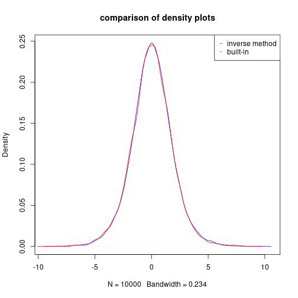
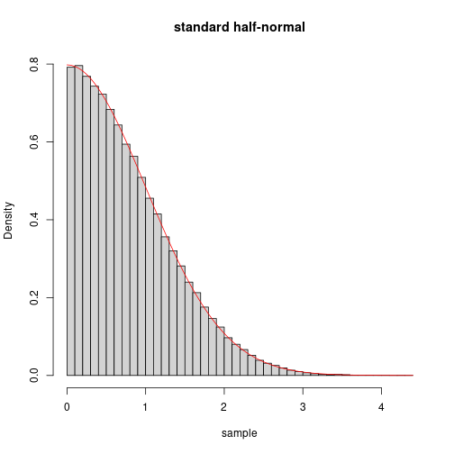
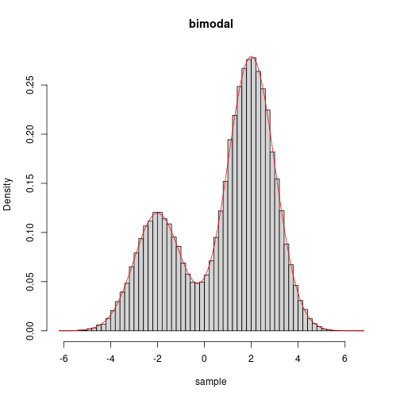

# Problem 1

Write your own code and find solution to the equation $x^3 + x - 4 = 0$ using
Newton’s method and the secant method.
Compare the number of iterations needed for different starting values for the
two methods.

## Solution: Newton's method

If we have some function $f : \mathbb{R} \mapsto \mathbb{R}$ and we wish to
find a root of $f$, i.e., an $x$ such that $f(x) = 0$, we may use Newton's method.

We take an initial guess of the root as $x_0$ and try to refine it
with a linear approximation of $f$ given by
$$
  L(f | x_0) \coloneqq \lambda x.f(x_0) + f'(x_0)(x-x_0).
$$

Now, we may approximate a root of $f$ with a root of $L(f|x_0)$,
$$
  L(f|x_0)(x) = 0,
$$
which may be rewritten as
$$
  f(x_0) + f'(x_0)(x-x_0) = 0.
$$
Solving for a root $x$ of $L(f|x_0)$ we get the result
$$
  x = x_0 - \frac{f(x_0)}{f'(x_0)}.
$$

Hoping that $x$ results in a better approximation of the root of $f$ than
$x_0$, we approximate $f$ with $L(f|x)$ and repeat the process.

Generalizing this result, we obtain the iterative procedure
$$
  x_{i+1} = x_i - \frac{f(x_i)}{f'(x_i)}.
$$
We continue this process until we obtain some stopping condition, e.g.,
$|x_{i+1} - x_i| < \epsilon$.

Letting $f(x) \coloneqq x^3 + x - 4$ and $f'(x) = 3x^2 + 1$ and substituting
into the above result, we get the result
$$
  x_{i+1} = x_i - \frac{x_i^3+x_i-4}{3x_i^2+1}.
$$

We implement a general procedure for Newton's method:

``` r
newton_method <- function(f,dfdx,x0,eps,debug=T)
{
  n <- 0
  repeat
  {
    x1 <- x0 - f(x0) / dfdx(x0)
    n <- n + 1
   
    if (debug) { cat("iteration=",n," x=",x1,"\n") }
    if(abs(x1 - x0) < eps) { break } # stopping condition
    x0 <- x1
  }
  
  list(root=x0,iter=n,eps=eps)
}
```

We take an initial guess of $x_0 = 1$ and $\epsilon = 1 \times 10^{-6}$ and
run the following R code to solve for a root of $f$ using Newton's method:

``` r
f <- function(x) { x^3 + x - 4 }
dfdx <- function(x) { 3*x^2 + 1 }
eps <- 1e-6
x0 <- 1
result <- newton_method(f,dfdx,x0,eps)
```

```
## iteration= 1  x= 1.5 
## iteration= 2  x= 1.387097 
## iteration= 3  x= 1.378839 
## iteration= 4  x= 1.378797 
## iteration= 5  x= 1.378797
```

``` r
print(result)
```

```
## $root
## [1] 1.378797
## 
## $iter
## [1] 5
## 
## $eps
## [1] 1e-06
```

We obtain $x \approx 1.3787967$ after $5$ iterations.

## Solution: Secant method

In Newton's method, we linearize $f$ using the derivative of $f$. If, instead,
we use the secant of $f$ with respect to two inputs $x_i$ and $x_{i+1}$, as
given by
$$
  \frac{f(x_{i+1}) - f(x_i)}{x_{i+1}-x_i},
$$
we get the iterative procedure
$$
  x_{i+2} = x_{i+1} - f(x_{i+1})\frac{x_{i+1}-x_i}{f(x_{i+1}) - f(x_i)},
$$
which requires two initial values $x_0$ and $x_1$.

We define the secant method as a function given by:


``` r
secant_method <- function(f,x0,x1,eps,debug=T)
{
  n <- 0
  repeat
  {
    x2 <- x1 - f(x1) * (x1 - x0) / (f(x1) - f(x0))
    n <- n + 1
    
    if (debug) { cat("iteration=",n," x=",x2,"\n") }
    
    if(abs(x2-x1) < eps) { break } # stopping condition
    x0 <- x1
    x1 <- x2
  }
  
  list(root=x1,iter=n,eps=eps)
}
```

We let $x_0 = 0$, $x_1 = 1$, and keep everything else the same and run the
secant method with the following R code:

``` r
x0 <- 0
x1 <- 1
result <- secant_method(f,x0,x1,eps)
```

```
## iteration= 1  x= 2 
## iteration= 2  x= 1.25 
## iteration= 3  x= 1.337931 
## iteration= 4  x= 1.382262 
## iteration= 5  x= 1.378708 
## iteration= 6  x= 1.378797 
## iteration= 7  x= 1.378797
```

``` r
print(result)
```

```
## $root
## [1] 1.378797
## 
## $iter
## [1] 7
## 
## $eps
## [1] 1e-06
```

We obtain $x \approx 1.3787965$ after $7$ iterations.
Note that this is $2$ more iterations than Newton's method.

## Comparison of Newton's method versus secant method

We perform $n=100000$ trials to get a better view of how the two methods,
Newton and secant, compare over many different initial guesses.

We generate the data with:

``` r
n <- 100000
from <- 0
to <- 4
by <- (to-from)/n
newt_sols <- vector(length=n)
sec_sols <- vector(length=n)
i <- 1
for (x0 in seq(from=from, to=to, by=by))
{
  newt_sols[i] <- newton_method(f,dfdx,x0,eps,F)$iter
  sec_sols[i] <- secant_method(f,x0,x0+1,eps,F)$iter
  i <- i + 1
}
```

We summarize the results and report them with:

``` r
cat("mean iterations\n",
    "newton => ", mean(newt_sols), "\n",
    "secant => ", mean(sec_sols), "\n")
```

```
## mean iterations
##  newton =>  5.819542 
##  secant =>  7.231338
```

We see that Newton's method, on average, requires
$1.4117959$ fewer iterations before the stopping
condition is satisfied.

# Problem 2
Poisson regression. The Ache hunting data set has $n = 47$ observations
recording is the number of monkeys killed over a period of days with each hunter
along with hunter’s age.
It is of interest to estimate and quantify the monkey kill rate as a function of
hunter’s age. Hunting prowess confers elevated status among the group, so a
natural question is whether hunting ability improves with age,
and at which age hunting ability is best.

Hand-code Newton-Raphson in R to fit the Poisson regression model
$$
  \mathit{monkeys}_i \sim \operatorname{Pois}\left(\exp(\log \mathit{days}_i  + \theta_1 + \theta_2 \mathit{age}_i + \theta_3 \mathit{age}_i^2)\right).
$$

Feel free to use jacobian and hessian in the numDeriv R package. You may need a sets of crude
starting values.
I run a linear regression for the "empirical log-rates" and get starting values
$(5.99, 0.167, 0.001)$.
Feel free to use those. Compare your result with glm() function in R using

``` r
glm(monkeys~age+I(age^2), family="poisson", offset=log(days), data=d)
```

## Solution

We are given the following data:

``` r
d <- read.table("ache.txt", header=T)
n <- length(d$age)
X <- cbind(rep(1,n), d$age, d$age^2)

loglike <- function(theta)
{
  sum(dpois(d$monkeys,exp(log(d$days)+X%*%theta),log=T))
}

# print the data
print(d)
```

```
##    hunter age monkeys days
## 1       1  67       0    3
## 2       2  66       0   89
## 3       3  63      29  106
## 4       4  60       2    4
## 5       5  61       0   28
## 6       6  59       2   73
## 7       7  58       3    7
## 8       8  57       0   13
## 9       9  56       0    4
## 10     10  56       3  104
## 11     11  55      27  126
## 12     12  54       0   63
## 13     13  51       7   88
## 14     14  50       0    7
## 15     15  48       3    3
## 16     16  49       0   56
## 17     17  47       6   70
## 18     18  42       1   18
## 19     19  39       0    4
## 20     20  40       7   83
## 21     21  40       4   15
## 22     22  39       1   19
## 23     23  37       2   29
## 24     24  35       2   48
## 25     25  35       0   35
## 26     26  33       0   10
## 27     27  33      19   75
## 28     28  32       9   63
## 29     29  32       0   16
## 30     30  31       0   13
## 31     31  30       0   20
## 32     32  30       2   26
## 33     33  28       0    4
## 34     34  27       0   13
## 35     35  25       0   10
## 36     36  22       0   16
## 37     37  22       0   33
## 38     38  21       0    7
## 39     39  20       0   33
## 40     40  18       0    8
## 41     41  17       0    3
## 42     42  17       0   13
## 43     43  17       0    3
## 44     44  56       0   62
## 45     45  62       1    4
## 46     46  59       1    4
## 47     47  20       0   11
```

Observe that the design matrix is defined as
$$
X =
  \begin{pmatrix}
  1       & a_1 &     a_1^2\\
  1       & a_2       & a_2^2\\
  \vdots  & \vdots    & \vdots\\
  1       & a_n       & a_n^2\\
  \end{pmatrix},
$$
the parameter vector is defined as
$$
\vec{\theta} =
  \begin{pmatrix}
    \theta_1\\
    \theta_2\\
    \theta_3
  \end{pmatrix},
$$
and the response variables are defined as
$$
\vec{m} =
  \begin{pmatrix}
    m_1\\
    m_2\\
    \vdots\\
    m_n
  \end{pmatrix}.
$$
  
In poisson regression, we find the best fit for
$$
  M_i \sim \mathrm{POI}(\exp(\log d_i + X \vec{\theta})).
$$
where $M_i$ is the random response variable for $i=1,\ldots,n$.


We generalize the univariate Newton's method in Problem 1 to the multivariate
case.
We implement the multivariate Newton-Raphson method with numerical hessian and
jacobian with the following R code:

``` r
library(numDeriv)
newton_raphson_method <- function(x0,f,eps)
{
  n <- 0
  x1 <- x0
  repeat
  {
      x1 <- x0 - solve(hessian(f,x0))%*%t(jacobian(f,x0))
      n <- n + 1
      if (n %% 7 == 0) { cat("iteration=",n," theta=",x1,"\n") }
      if (max(abs(x1 - x0)) < eps)
      {
        break
      }
      x0 <- x1
  }
  list(root=x1,iter=n)
}
```

We use the multivariate Newton-Raphson method to find the MLE of $\theta$ in
the poisson regression model:

``` r
eps <- 1e-6
theta0 <- c(5.99, 0.167, 0.001) # starting values
theta_mle <- newton_raphson_method(theta0,loglike,eps)$root
```

```
## iteration= 7  theta= -1.011118 0.1670372 0.000999693 
## iteration= 14  theta= -7.590761 0.153262 0.00111206 
## iteration= 21  theta= 1.438483 -0.2696712 0.003827084 
## iteration= 28  theta= -5.484246 0.1246477 -0.001203418
```

The MLE of $\theta$ is given by:

``` r
theta_mle
```

```
##              [,1]
## [1,] -5.484245903
## [2,]  0.124647667
## [3,] -0.001203418
```

We compare the results with the builtin method:

``` r
glm(monkeys~age+I(age^2),family="poisson", offset=log(days),data=d)$coefficients
```

```
##  (Intercept)          age     I(age^2) 
## -5.484245904  0.124647667 -0.001203418
```

The hand-coded approach and the builtin approach obtain the same
point estimate $\hat\theta = (-5.4842, 0.1246, -0.0012)'$.

# Problem 3

Logistic and Cauchy distributions are well-suited to the inverse transform method.
For each of the following, generate $10,000$ random variables using the inverse transform.
Compare your program with the built-in R functions rlogis() and rcauchy(), respectively:

## Solution: part (a)
Standard logistic distribution
$$
  F(x) = \frac{1}{1+e^{-x}}
$$

Solve for $x$ in
$$
\begin{align*}
  u &= F(x)\\
  u &= \frac{1}{1+e^{-x}}\\
  x &= \log(u/(1-u)).
\end{align*}
$$


``` r
n <- 10000
us <- runif(n)
d1 <- density(log(us/(1-us)))
d2 <- density(rlogis(n))
plot(d1,col="blue",main="comparison of density plots")
lines(d2,col="red")
legend(x="topright",legend=c("inverse method","built-in"),col=c("blue","red"),
       pch=c("-","-"))
```



## Solution: part (b)
Standard Cauchy distribution
$$
  F(x) = \frac{1}{2} + \frac{1}{\pi} \operatorname{arctan(x)}
$$

Solve for $x$ in
$$
\begin{align*}
  u &= F(x)\\
  u &= \frac{1}{2} + \frac{1}{\pi} \operatorname{arctan(x)}\\
  x &= \tan(\pi(u-1/2)).
\end{align*}
$$


``` r
n <- 1000
us <- runif(n)
d1 <- tan(pi*(us-0.5))
d2 <- rcauchy(n=n)

d1 <- d1[d1 > -20 & d1 < 20]
d2 <- d2[d2 > -20 & d2 < 20]

c1 <- rgb(0,0,255, max = 255, alpha = 50, names = "blue")
c2 <- rgb(255,0,0, max = 255, alpha = 50, names = "red")

par(mfrow=c(1,2))
hist(d1,col=c1,freq=F,breaks=50,main="inverse-transform method vs built-in")
hist(d2,col=c2,add=T,freq=F,breaks=50)
legend(x="topright",legend=c("inv","builtin"),col=c("blue","red"),pch=c("-","-"))
plot(density(d1), col="blue",main="density plot")
lines(density(d2), col="red") 
legend(x="topright",legend=c("inv","builtin"),col=c("blue","red"),pch=c("-","-"))
```


# Problem 4
Generating $10,000$ random variables from $\operatorname{Geometric}(p)$ 
distribution based off Bernoulli trials.

## Solution

A random variable $X \sim \operatorname{Geometric(p)}$ is given by the number of
i.i.d. trials needed to have a success where success occurs with probability $p$.

Thus, we may simulate this distribution with the following R code:

``` r
# simulate n realizes of geometric(p)
rgeo <- function(n,p)
{
  outcomes <- vector(length=n)
  for (i in 1:n)
  {
    trials <- 0
    while (T)
    {
      trials <- trials + 1
      if (rbinom(1,1,p) == 1)
      {
        break
      }
    }
    outcomes[i] <- trials
  }
  outcomes
}
```

When we use this function to draw a sample of $n=10000$ geoemtrically distributed
random variables with $p=0.2$, we obtain:

``` r
p <- .2
n <- 10000
sample <- rgeo(n,p)
cat("the mean should be approximate 1/p =", 1/p, " and we obtain a mean of ", mean(sample))
```

```
## the mean should be approximate 1/p = 5  and we obtain a mean of  4.9587
```


# Problem 5
Generate random values from a Standard Half Normal distribution with pdf,
$$
f(x) = \frac{2}{\sqrt{2 \pi}} e^{-x^2/2} , x > 0.
$$

For the candidate pdf, choose the exponential density with rate $1$. Verify that
your method works via a plot of the true density, and a histogram of the
generated values.

## Solution

We are given the density of the standard half-normal distribution,
$$
  \operatorname{dhalfnormal}(x) = \frac{2}{\sqrt{2 \pi}} e^{-x^2/2}, x > 0.
$$

We model this density with the following R code:

``` r
# density for standard half-normal
dhalfnormal <- function(x) { 2/sqrt(2*pi)*exp(-x^2/2) }
```

We sample from the exponential distribution $\operatorname{EXP}(\lambda=1)$,
with density $g$ and thus we first find the $c$ satisfying
$$
  c = \max \left\{ \frac{\operatorname{dhalfnormal}(x)}{\operatorname{dexp}(x|\lambda=1)} | x \in \mathbb{R} \right\},
$$
which is found to be approximately $c = 1.315489247$.

We implement the standard half-normal sampler, $\operatorname{rhalfnormal}$,
using the acceptance-rejection sampling technique with the following R code:

``` r
# accept-rejection sampling for standard half-normal
# using exp(rate=1)
rhalfnormal <- function(N)
{
  c <- 1.315489247
  xs <- vector(length=N)
  k <- 1
  while (T)
  {
    x <- rexp(n=1)
    if (runif(n=1) < dhalfnormal(x)/(c*dexp(x)))
    {
      xs[k] <- x
      k <- k + 1
      if (k == N)
      {
        break
      }
    }
  }
  xs
}
```

We simulate drawing $n=100000$ samples from the standard half-normal
distribution and plotting a histogram of the sample with its density overload in
red on top of it with the following R code:

``` r
n <- 100000
sample <- rhalfnormal(n)
hist(sample,freq=F,breaks=50,main="standard half-normal")
curve(dhalfnormal(x),add=TRUE,col="red") 
```



We see that the histogram is compatible with being drawn from the overload
density.

# Problem 6

Use accept-reject to sample from this bimodal density:
$$
  f(x) \propto 3 e^{-0.5(x+2)^2} + 7 e^{-0.5(x-2)^2}
$$
The normalizing constant is $25.066$. For your proposal $g(·)$, use a
$N(0, 2^2)$ distribution. Verify that your method works via a plot of the true
normalized density, and a histogram of the generated values.

## Solution
We are given the kernel of the bimodal distribution of interest,
$$
  \operatorname{ker-bimodal}(x) = 3 e^{-0.5(x+2)^2} + 7 e^{-0.5(x-2)^2},
$$
with the normalizing constant $C = 25.0663$ and thus the pdf for the bimodal is
given by
$$
  \operatorname{dbimodal}(x) = \frac{\operatorname{ker}(x)}{C}.
$$

We model these two functions with the following R code:

``` r
# density for biomodal density
kerbimodal <- function(x) { 3*exp(-0.5*(x+2)^2) + 7*exp(-0.5*(x-2)^2) }
kerbimodal.C <- 25.0663
dbimodal <- function(x) { kerbimodal(x) / kerbimodal.C }
```

We sample from the normal distribution $N(\mu=0,\sigma^2=2^2)$, with density
$g$ and thus we first find the $c$ satisfying
$$
  c = \max \left\{ \frac{\operatorname{ker-bimodal}(x)}{g(x|\mu=0,\sigma^2=2^2)} | x \in \mathbb{R} \right\},
$$
which is found to be approximately $c = 68.35212$.

We implement the bimodal sampler, $\operatorname{rbimodal}$, using the
acceptance-rejection sampling technique with the following R code:

``` r
# accept-rejection sampling for bimodal distribution with density dbimodal
# using normal(0,2^2).
rbimodal <- function(N)
{
  c <- 68.35212
  xs <- vector(length=N)
  k <- 1
  while (T)
  {
    x <- rnorm(n=1,mean=0,sd=2)
    if (runif(n=1) < kerbimodal(x)/(c*dnorm(x,mean=0,sd=2)))
    {
      xs[k] <- x
      if (k == N)
      {
        break
      }
      k <- k + 1
    }
  }
  xs
}
```

We simulate drawing $n=100000$ samples from the bimodal distribution
and plotting a histogram of the sample with its density overload in red on top
of it with the following R code:

``` r
n <- 100000
sample <- rbimodal(n)
hist(sample,freq=F,breaks=50,main="bimodal")
curve(dbimodal(x),add=TRUE,col="red") 
```



We see that the histogram is compatible with being drawn from the overload
density.
