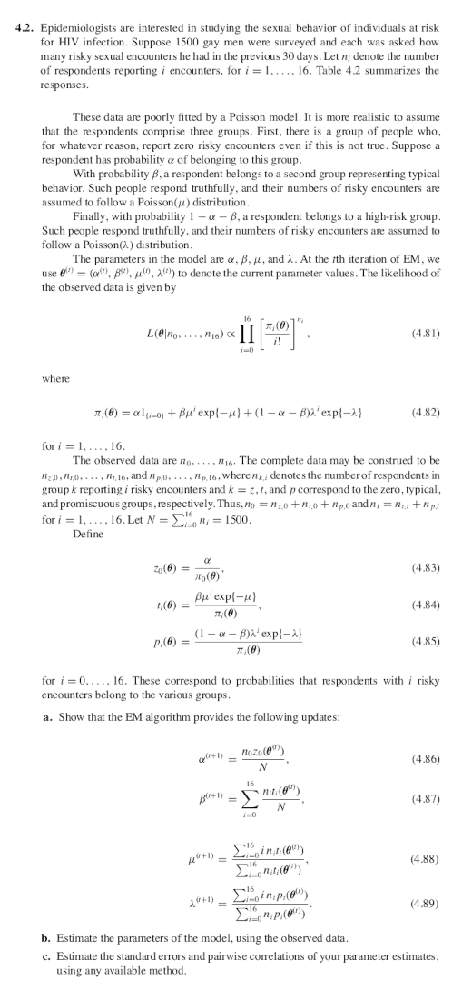

# Problem 1
Derive the E-M algorithm for right-censored normal data with known variance, say $2 = 1$. Consider $Y_i$’s that are i.i.d. from a $N(\theta, 1)$, $i=1,2\ldots, n$. We observe $(x_1, \ldots, x_n)$ and $(\delta_1, \ldots, \delta_n)$, where $x_i = \min(y_i,c)$, and $\delta_i = I(y_i < c)$. Let $C$ be the total number of censored (incomplete) observations. We denote the missing data as $\{Z_i : \delta_i = 0\}$.

## Part (a)
Derive the complete log-likelihood, $\ell(\theta | Y)$.

### Solution
The unobserved random variates $\{Y_i\}$ are i.i.d. normally distributed,
$$
  Y_i \sim f_{Y_i}(y | \theta)
$$
where
$$
  f_{Y_i}(y | \theta) = (2 \pi)^{-\frac{1}{2}} \exp\left(-\frac{1}{2}(y - \theta)^2\right).
$$

The likelihood function is therefore
$$
\begin{align*}
  L(\theta | \{y_i\})
    &= \prod_{i=1}^{n} (2 \pi)^{-\frac{1}{2}} \exp\left(-\frac{1}{2}(y_i - \theta)^2\right)\\
    &= (2 \pi)^{-\frac{n}{2}} \exp\left(-\sum_{i=1}^{n} \frac{1}{2}(y_i - \theta)^2\right).
\end{align*}
$$

Taking the logarithm of $L$,
$$
\begin{align*}
  \ell(\theta | \{y_i\})
    &= \log L(\theta | \{y_i\})\\
    &= -\frac{n}{2} \log (2 \pi) - \frac{1}{2} \sum_{i=1}^{n} (y_i - \theta)^2\\
    &= -\frac{n}{2} \log (2 \pi) - \frac{1}{2} \sum_{i=1}^{n} y_i^2 + \theta \sum_{i=1}^{n} y_i - \frac{n}{2} \theta^2.
\end{align*}
$$

Anticipating that we will be maximizing the complete log-likelihood with respect
to $\theta$, we put any terms that are not a function of $\theta$ into $k$,
obtaining the result
$$
  \ell(\theta | \{y_i\}) = k + \theta \sum_{i=1}^{n} y_i - \frac{n}{2} \theta^2.
$$


## Part (b)

Show the conditional expectation
$$
  E(Y | x, \delta=1, \theta^{(t)}) = x
$$
and
$$
  E(Y | x, \delta=0, \theta^{(t)}) = E(Y | Y > x) = \theta^{(t)} + \frac{\phi(x-\mu)}{1 - \Phi(x-\mu)}
$$
where $\phi$ and $\Phi$ are pdf and cdf of standard normal.

### Solution

The distribution of $Y$ given $\delta = 1$, is uncensored
and therefore it is given that $Y$ realized the value $x$.
Since the expectation of a constant $x$ is $x$, that means
$E(Y | Y = x) = x$.

If $\delta = 0$, $Y$ is censored, i.e., $Y > x$.
To take its expectation, we first need to derive the conditional conditional distribution of $Y$ given $Y > x$ and $\theta^{(t)}$.

The probability $\Pr(Y \leq y | Y > x)$ is given by
$$
  \Pr(Y \leq y | Y > x) = \Pr(x < Y \leq y) / \Pr(Y > x)
$$
which may be rewritten as
$$
  \Pr(Y \leq y | Y > x) = \frac{F_Y(y | \theta^{(t)}) - F_Y(x | \theta^{(t)})}{1 - F_Y(y | \theta^{(t)})}.
$$
where $F_{Y|\theta^{(t)}}$ is the cdf of the normal distribution with $\sigma=1$ and $\mu=\theta^{(t)}$.

We may rewrite $F_{Y|\theta^{(t)}}$ in terms of the standard normal,
$$
  F_{Y}(y|\theta^{(t)}) = \Phi(y - \theta^{(t)}),
$$
and thus we may rewrite the conditional distribution of $Y | Y > x$ as
$$
  \Pr(Y \leq y | Y > x) = \frac{\Phi(y - \theta^{(t)}) - \Phi(x - \theta^{(t)})}{1 - \Phi(x - \theta^{(t)})}
$$
and thus after further simplifying, we obtain the cdf of $Y | x$,
$$
    F_{Y|x}(y|\theta^{(t)}) = 1 - \frac{1- \Phi(y - \theta^{(t)})}{1 - \Phi(x - \theta^{(t)})}
$$
which has a density given by
$$
    f_{Y}(y|x,\theta^{(t)}) = \frac{\phi(y - \theta^{(t)})}{1 - \Phi(x - \theta^{(t)})} I(y > x).
$$


The expectation of $Y|(x,\theta^{(t)})$ is given by
$$
\begin{align*}
  E(Y|x,\theta^{(t)})
    &= \int_{x}^{\infty} y f_{Y}(y|x,\theta^{(t)}) dy\\
    &= \int_{x}^{\infty} y \left(\frac{\phi(y - \theta^{(t)})}{1 - \Phi(x - \theta^{(t)})}\right) dy\\
    &= \frac{1}{{1 - \Phi(x - \theta^{(t)})}}\int_{x}^{\infty} y \phi(y - \theta^{(t)}) dy.
\end{align*}
$$

Analytically, this is a tricky integration problem.
Certainly, it would be trivial to numerically integrate this to obtain a solution, but we seek a closed-form solution.

I searched online, and discovered an interesting way to tackle this integration problem.

Let $f$ and $F$ respectively denote the pdf and cdf of the normally distributed $Y$. Then,
$$
  \frac{df}{dy} = -(y - \theta) f(y)
$$
and
$$
  \int_{a}^{b} \frac{df}{dy} dy = f(b) - f(a).
$$

Then,
$$
\begin{align*}
  E(Y|x,\theta^{(t)})
    &= \frac{1}{1 - F(x)}\int_{x}^{\infty} y f(y) dy\\
    &= -\frac{1}{1 - F(x)}\int_{x}^{\infty} - (y -\theta^{(t)}) f(y) dy + \frac{\theta^{(t)}}{1-F(x)}\int_{x}^{\infty} f(y) dy\\
    &= -\frac{1}{1 - F(x)}\int_{x}^{\infty} \frac{df}{dy} dy + \frac{\theta^{(t)}}{1-F(x)} (1-F(x))\\
    &= -\frac{1}{1 - F(x)}\left(f(\infty) - f(x)\right) + \theta^{(t)}\\
    &= \frac{f(x)}{1 - F(x)} + \theta^{(t)}.
\end{align*}
$$

We may rewrite the last line as
$$
  E(Y|x,\theta^{(t)}) = \theta^{(t)} + \frac{\phi(x-\theta^{(t)})}{1 - \Phi(x-\theta^{(t)})}.
$$

## Part (c)
Derive the $E$-step and $M$-step using parts (a) and (b). Give the updating equation.

### Solution

#### E-step
The $E$-step entails taking the conditional expectation of the complete log-likelihood function $\ell(\theta | \{Y_i\})$ given the observed data $\{x_i\}$ and $\{\delta_i\}$.

$$
\begin{align*}
  Q(\theta | \theta^{(t)})
    &= E_{Y_i | x_i,\delta_i}(\ell(\theta | \{Y_i\})\\
    &= E_{Y_i | x_i,\delta_i}\left(k + \theta \sum_{i=1}^{n} Y_i - \frac{n}{2} \theta^2\right)\\
    &= k - \frac{n}{2}\theta^2 + \theta \sum_{i=1}^{n} E_{Y_i | x_i,\delta_i}(Y_i).
\end{align*}
$$

We have already solved the expectation of $Y_i$ given $x_i$ and $\delta_i$. We rewrite $Q$ by substituting $E(Y_i | x_i, \delta_i)$ with its previously found solution,
$$
  Q(\theta | \theta^{(t)}) = k - \frac{n}{2}\theta^2 + \theta \sum_{i=1}^{n} \delta_i x_i + (1-\delta_i) \left(\theta^{(t)} + \frac{\phi(x_i-\theta^{(t)})}{1 - \Phi(x_i-\theta^{(t)})}\right).
$$

Letting $C = \sum_{i=1}^{n} (1 - \delta_i)$, $R = \sum_{i=1}^{n} \delta_i x_i$,
and separating out all terms that are independent of $\theta^{(t)}$,
$$
  Q(\theta | \theta^{(t)}) = k - \frac{n}{2}\theta^2 + C \theta \theta^{(t)} + R \theta
    + \theta \sum_{i=1}^{n} \frac{(1-\delta_i)\phi(x_i-\theta^{(t)})}{1 - \Phi(x_i-\theta^{(t)})}.
$$

#### M-step
We wish to solve
$$
  \theta^{(t+1)} = \arg\max_{\theta} Q(\theta | \theta^{(t)}).
$$
by solving
$$
  \frac{d Q(\theta | \theta^{(t)})}{d \theta}\Biggr|_{\theta=\theta^{(t+1)}} = 0,
$$
which may be written as
$$
  -n\theta^{(t+1)} + C \theta^{(t)} + R + \sum_{i=1}^{n} \frac{(1-\delta_i)\phi(x_i-\theta^{(t)})}{1 - \Phi(x_i-\theta^{(t)})} = 0.
$$

Solving for $\theta^{(t+1)}$ obtains the updating equation
$$
  \theta^{(t+1)} = \frac{R}{n} + \frac{C}{n} \theta^{(t)} + \frac{1}{n}\sum_{i=1}^{n}\frac{(1-\delta_i)\phi(x_i-\theta^{(t)})}{1 - \Phi(x_i-\theta^{(t)})}.
$$
where 
$$
  R = \sum_{i=1}^{n} \delta_i x_i
$$
and
$$
  C = \sum_{i=1}^{n} (1-\delta_i).
$$

## Part (d)
Use your algorithm on the V.A. data to find the MLE of $\mu$. Take the log of the event times first and standardize by sample standard deviation. You may simply use the censored data sample mean as your starting value.

### Solution

In the following R code, we implement the updating equation derived in the previous step. We encapulsate the procedure into a function that takes its arguments in
the form of a censored set, uncensorted set, starting value ($\theta^{(1)}$), and an $\epsilon$ value to control stopping condition.


``` r
# assuming the uncensored and censored data are distributed normally,
# we use the EM algorithm to derive an estimator given censored and uncensored
# data.
mean_normal_censored_estimator_em <- function(uncensored,censored,theta,eps=1e-6,debug=T)
{
  dev <- sd(log(c(uncensored,censored)))
  censored <- log(censored) / dev
  uncensored <- log(uncensored) / dev
  theta <- log(theta) / dev
  
  n <- length(censored) + length(uncensored)
  C <- length(censored)
  R <- sum(uncensored)
  
  s <- function(theta)
  {
    sum <- 0
    for (i in 1:C)
    {
      num <- dnorm(censored[i],mean=theta,sd=1)
      denom <- 1-pnorm(censored[i],mean=theta,sd=1)
      sum <- sum + (num / denom)
    }
    sum
  }
  
  i <- 1
  repeat
  {
    theta.new <- R/n + C/n * theta + (1/n)*s(theta)
    if (debug==T) { cat("theta[", i, "] =",theta,", theta[", i+1, "] =",theta.new,"\n") }
    if (abs(theta.new - theta) < eps)
    {
      theta <- theta.new * dev
      theta <- exp(theta)
      return(theta)
    }
    i <- i + 1
    theta <- theta.new
  }
}
```

We apply this procedure to the indicated data set.

``` r
library(MASS) # has VA data
VAs <- subset(VA,prior==0)
censored <- VAs$status == 0
censored_xs <- VAs[censored,c("stime")]
uncensored_xs <- VAs[!censored,c("stime")]

mu <- mean(uncensored_xs)
cat("mean of the uncensored sample is ", mu, ".")
```

```
## mean of the uncensored sample is  112.1648 .
```

``` r
sol <- mean_normal_censored_estimator_em(uncensored_xs,censored_xs,mu)
```

```
## theta[ 1 ] = 3.857928 , theta[ 2 ] = 3.424258 
## theta[ 2 ] = 3.424258 , theta[ 3 ] = 3.415443 
## theta[ 3 ] = 3.415443 , theta[ 4 ] = 3.415286 
## theta[ 4 ] = 3.415286 , theta[ 5 ] = 3.415283 
## theta[ 5 ] = 3.415283 , theta[ 6 ] = 3.415283
```

``` r
sol
```

```
## [1] 65.2625
```

We see that our estimate of $\theta$ is $\hat{\theta} = 65.2624985$. (The $\theta$ before transforming it to the appropriate scale was $3.415283$.)

This mean is somewhat lower than anticipated, which makes me suspect something is wrong with my updating equation. If I have the time, I will revisit it.

# Problem 2



## Solution

### Part (a)

There are $N=1500$ gay men in the survey sample where $X_i$ denotes the $i$-th persons response to the number of risky sexual encounters he had in the previous $30$ days.
Thus, we observe a sample $\vec{X} = (X_1,X_2,\ldots, X_N)$.

We assume there are $3$ groups in the population, denoted by $z=1$, $t=2$, and $p=3$. Group $1$ members report $0$ risky sexual encounters regardless of the truth where the probability of being a member of group $1$ is denoted by $\alpha$,

Group $2$ members accurately report risky sexual encounters and represent typical behavior where the probability of being a member of group $2$ is denoted by $\beta$. We assume this group's number of sexual encounters follows a poisson with mean $\mu$.

Group $3$ members accurately report risky sexual encounters and represent high-risk behavior where the probability of being a member of group $3$ is $\gamma = 1-\alpha-\beta$. We assume this group's number of sexual encounters follows a poisson with mean $\lambda$.

This represents a finite mixture model with a pdf
$$
  X_i \sim f(x | \vec{\theta}) = \alpha I(x=0) +
    \beta \mathrm{Poi}(x | \mu) + (1-\alpha-\beta)\mathrm{Poi}(x | \lambda)
$$
with a parameter vector
$$
  \vec{\theta} = (\alpha,\beta,\mu,\lambda)'.
$$

Let the uncertain group that the $i$-th person belongs to be denoted by $Z_i$. If we observe group membership data, $X_i | Z_i = z_i$, then
$$
\begin{align*}
  X_i | Z_i &= 1 \sim I(x=0),\\
  X_i | Z_i &= 2 \sim \mathrm{Poi}(\mu),\\
  X_i | Z_i &= 3 \sim \mathrm{Poi}(\lambda),
\end{align*}
$$
where
$$
  Z_i \sim f_{Z_i}(z_i | \vec{\theta}) = \Pr(Z_i=z_i) = 
  \begin{cases}
    \alpha                  & z_i = 1,\\
    \beta                   & z_i = 2,\\
    \gamma=1-\alpha-\beta   & z_i = 3,
  \end{cases}
$$
and thus
$$
  f_{X_i,Z_i}(x_i,z_i | \vec{\theta}) =
    \alpha I(z_i = 1) + \beta \mathrm{Poi}(\mu) I(z_i = 2) + (1-\alpha-\beta) \mathrm{Poi}(\lambda) I(z_i=3).
$$

The **complete** likelihood function is thus given by
$$
  \mathcal{L}(\vec{\theta} | \vec{X}, \vec{Z}) = \prod_{i=1}^{N} f_{X_i,Z_i}(x_i,z_i | \vec{\theta}),
$$
which may be rewritten as
$$
  \mathcal{L}(\vec{\theta} | \vec{X}, \vec{Z}) =
    \left(\prod_{\{i | z_i = 1\}} \alpha I(x_i=0)\right)
    \left(\prod_{\{i | z_i = 2\}} \beta \frac{\mu^{x_i} e^{-\mu}}{x_i!}\right)
    \left(\prod_{\{i | z_i = 3\}} \gamma \frac{\lambda^{x_i} e^{-\lambda}}{x_i!}\right).
$$


We wish to rewrite this so that the data is explicitly represented. First, we do the transformation
$$
  \mathcal{L}(\vec{\theta} | \vec{X}, \vec{Z}) =
    \left(\prod_{\{i | z_i = 1, x_i = 0 \}} \alpha\right)
    \prod_{k=0}^{16} \left(\prod_{\{i | z_i = 2, x_i = k\}} \beta \frac{\mu^{k} e^{-\mu}}{k!}\right)
    \prod_{k=0}^{16} \left(\prod_{\{i | z_i = 3, x_i = k\}} \gamma \frac{\lambda^{k} e^{-\lambda}}{k!}\right).
$$

We let $n_{a,b}$ denote the (unobserved) cardinality of $\{i | z_i = a, x_i = b\}$,
thus
$$
  \mathcal{L}(\vec{\theta} | \{n_{j,k}\}) =
    \alpha^{n_{1,0}}
    \prod_{k=0}^{16} \beta^{n_{2,k}} \frac{\mu^{k n_{2,k}} e^{-\mu n_{2,k}}}{(k!)^{n_{2,k}}}
    \prod_{k=0}^{16} \gamma^{n_{3,k}} \frac{\lambda^{k n_{3,k}} e^{-\lambda n_{3,k}}}{(k!)^{n_{3,k}}}
$$
is the complete likelihood.
The complete log-likelihood is thus
$$
  \ell(\vec{\theta} | \{n_{j,k}\}) =
    n_{1,0} \log \alpha +
    \sum_{k=0}^{16} \log \left(\beta^{n_{2,k}} \frac{\mu^{k n_{2,k}} e^{-\mu n_{2,k}}}{(k!)^{n_{2,k}}}\right) +
    \sum_{k=0}^{16} \log \left(\gamma^{n_{3,k}} \frac{\lambda^{k n_{3,k}} e^{-\lambda n_{3,k}}}{(k!)^{n_{3,k}}}\right)
$$
which simplies to
$$
\begin{split}
  \ell(\vec{\theta} | \{n_{j,k}\}) =
    n_{1,0} \log \alpha +
    \sum_{k=0}^{16}
      &n_{2,k}(\log \beta + k \log \mu - \mu - \log k!) + \\
      &n_{3,k}(\log \gamma + k \log \lambda - \lambda - \log k!).
\end{split}
$$

Anticipating taking $\frac{d \ell}{d \vec{\theta}}$ to solve for the maximum of
the log-likelihood, we remove any terms that are not a function of $\vec{\theta}$,
resulting in the kernel
$$
  \ell(\vec{\theta} | \{n_{j,k}\}) = n_{1,0} \log \alpha +
    \sum_{k=0}^{16} \left\{ n_{2,k}(\log \beta + k \log \mu - \mu) + n_{3,k}(\log \gamma + k \log \lambda - \lambda) \right\}.
$$

### E-step
The conditional expectation to solve in the EM algorithm is given by
$$
  Q(\vec{\theta} | \vec{\theta}^{(t)}) = E(\ell(\vec{\theta}))
$$
where $\{n_{k,j}\}$ are random and $\{n_j\}$ and $\vec{\theta}^{(t)}$ are given.
We rewrite this as
$$
Q(\vec{\theta} | \vec{\theta}^{(t)}) = E
  \left(
      n_{1,0} \log \alpha +
      \sum_{k=0}^{16} \left\{
        n_{2,k}(\log \beta + k \log \mu - \mu) +
        n_{3,k}(\log \gamma + k \log \lambda - \lambda)
        \right\}
  \right).
$$

Using the linearity of expectations, we rewrite the above to
$$
Q(\vec{\theta} | \vec{\theta}^{(t)}) = E(n_{1,0}) \log \alpha +
  \sum_{k=0}^{16} \left\{
    E(n_{2,k})(\log \beta + k \log \mu - \mu) +
    E(n_{3,k})(\log \gamma + k \log \lambda - \lambda) \right\}
$$
given $\{n_j\}$ and $\theta^{(t)}$.

Consider $E\!\left(n_{2,k} | \{n_j\}, \theta^{(t)}\right)$.
To solve this expectation, we must first derive the distribution of $n_{2,k}$.

Suppose $x_j = k$, then probability that the $j$-th person belongs to group $2$ is given by
$$
  \Pr(Z_j = 2 | x_j = k) = \Pr(Z_j = 2) \Pr(x_j = k | Z_j = 2) / \Pr(x_j = k).
$$
We note that $\Pr(x_j = k)$ is equivalent to $\pi_k(\vec{\theta})$, $\Pr(Z_j = 2)$ is the definition of $\beta$, and $\Pr(x_j = k | Z_j = 2)$ is
$f_{X_j|Z_j}(k | Z_j=2) = \mathrm{Poi}(k | \mu)$.

Making the substitutions yields the result
$$
  t_k(\vec{\theta}) = \Pr(Z_j = 2 | x_j = k) = \beta \mathrm{Poi}(k | \mu) / \pi_k(\vec{\theta}).
$$

Assuming $\{X_i\}$ are i.i.d., observe that $k \neq 0$, the distribution of $n_{2,k}$ given $n_k$, $\theta^{(t)}$ is binomial distributed with a probability of success $t_k(\vec{\theta}^{(t)})$.
Thus,
$$
  E(n_{2,k}) = n_k t_k(\vec{\theta}^{(t)}).
$$
The same logic holds for $n_{3,k}$ and $n_{1,0}$, and thus
$$
  E(n_{3,k}) = n_k p_k(\vec{\theta}^{(t)})
$$
and
$$
  E(n_{1,0}) = n_0 z_0(\vec{\theta}^{(t)}),
$$
which means
$$
Q(\vec{\theta} | \vec{\theta}^{(t)}) = n_0 z_0(\vec{\theta}^{(t)}) \log \alpha +
  \sum_{k=0}^{16} \left\{
    n_k t_k(\vec{\theta}^{(t)})(\log \beta + k \log \mu - \mu) +
    n_k p_k(\vec{\theta}^{(t)})(\log \gamma + k \log \lambda - \lambda) \right\}
$$

### M-step
We wish to solve
$$
  \vec{\theta}^{(t+1)} = \argmax_{\vec{\theta}} Q(\vec{\theta} | \vec{\theta}^{(t)}).
$$
by solving
$$
  \nabla Q(\vec{\theta} | \vec{\theta}^{(t)})\Bigr|_{\vec{\theta}=\vec{\theta}^{(t+1)}} = \vec{0}.
$$

We use the Lagrangian to impose the restriction $\alpha + \beta + \gamma = 1$, thus we seek to perform the constrained maximization of
$$
  Q_l(\vec{\theta},c | \vec{\theta}^{(t)}) = Q(\vec{\theta} | \vec{\theta}^{(t)}) + c(1-\alpha-\beta-\gamma).
$$

Thus, when we solve for $\alpha$,
$$
  \frac{\partial Q_l}{\partial \alpha} = \frac{n_0 z_0(\theta^{(t)})}{\alpha} - c = 0,
$$
we get the result
$$
  \alpha^{(t+1)} = \frac{1}{c} n_0 z_0(\theta^{(t)}).
$$

Similar results hold for $\beta$ and $\gamma$, obtaining
$$
  \beta^{(t+1)} = \frac{1}{c} \sum_{k=0}^{16} n_k t_k(\theta^{(t)}).
$$
and
$$
  \gamma^{(t+1)} = \frac{1}{c} \sum_{k=0}^{16} n_k p_k(\theta^{(t)}).
$$

This does not look too promising until we realize that
$$
  n_0 z_0(\theta^{(t)}) + \sum_{k=0}^{16} n_k t_k(\theta^{(t)}) + \sum_{k=0}^{16} n_k p_k(\theta^{(t)}) = N.
$$

Thus, $c (\alpha^{(t)}+\beta^{(t)}+\gamma^{(t)}) = N$, which means $c = N$ since $\alpha^{(t)}+\beta^{(t)}+\gamma^{(t)} = 1$.
Making this substitution obtains the result
$$
\begin{align*}
  \alpha^{(t+1)}    &= \frac{1}{N} n_0 z_0(\theta^{(t)})\\
  \beta^{(t+1)}     &= \frac{1}{N} \sum_{k=0}^{16} n_k t_k(\theta^{(t)})\\
  \gamma^{(t+1)}    &= \frac{1}{N} \sum_{k=0}^{16} n_k p_k(\theta^{(t)}).
\end{align*}
$$

Solving an estimator for $\mu$ at iteration $(t+1)$,
$$
\begin{align*}
  \frac{\partial Q_l}{\partial \mu}\biggr|_{\mu=\mu^{(t+1}} &= 0\\
  \sum_{k=0}^{16} n_k t_k(\theta^{(t)})(k/\mu^{(t+1)}-1)           &= 0\\
  \frac{1}{\mu^{(t+1)}} \sum_{k=0}^{16} n_k t_k(\theta^{(t)}) k    &= \sum_{k=0}^{16} n_k t_k(\theta^{(t)})\\
  \mu^{(t+1)} &= \frac{\sum_{k=0}^{16} k n_k t_k(\theta^{(t)})}{\sum_{k=0}^{16} n_k t_k(\theta^{(t)})}.
\end{align*}
$$

The same derivation essentially follows for $\lambda$, and thus
$$
  \lambda^{(t+1)} = \frac{\sum_{k=0}^{16} k n_k p_k(\theta^{(t)})}{\sum_{k=0}^{16} n_k p_k(\theta^{(t)})}.
$$

## Part (b)
Estimate the parameters of the model, using the observed data.

### Solution


``` r
# we observe n = (n0,n1,...,n16)
ns <- c(379,299,222,145,109,95,73,59,45,30,24,12,4,2,0,1,1)
N <- sum(ns)

# theta := (alpha, beta, mu, lambda)'
# note that there is an implicit parameter gamma s.t.
# alpha + beta + gamma = 1
# the initial value assumes each category z, t, or p
# is equally probable, and so we let
#     (alpha^(0),beta^(0)) = (1/3,1/3)
# and mu^(0) and lambda^(0) are just arbitrarily chosen to be 2 and 3,
# with the insight that group 3 is more risky than group 2.
theta <- c(1/3,1/3,2,3)

# theta := (alpha, beta, mu, lambda)
Pi <- function(i,theta)
{
  res <- 0
  if (i == 0)
    res <- theta[1]
  
  res <- res + theta[2] * theta[3]^i * exp(-theta[3])
  res <- res + (1 - theta[1] - theta[2]) * theta[4]^i * exp(-theta[4])
  res
}

z0 <- function(theta)
{
  theta[1] / Pi(0,theta)
}

t <- function(i,theta)
{
  theta[2] * theta[3]^i * exp(-theta[3]) / Pi(i,theta)
}

p <- function(i,theta)
{
  (1-theta[1] - theta[2]) * theta[4]^i * exp(-theta[4]) / Pi(i,theta)
}

# update algorithm, based on EM algorithm
update <- function(theta,ns)
{
  # note: n0 := ns[1] instead of ns[0] since R does not use zero-based indexes
  alpha <- ns[1] * z0(theta) / N
  beta <- 0
  mu_num <- 0
  mu_denom <- 0
  
  lam_num <- 0
  lam_denom <- 0

  for (i in 0:16)
  {
    ti <- t(i,theta)
    pi <- p(i,theta)
    
    beta <- beta + ns[i+1] * ti
    
    mu_num <- mu_num + i * ns[i+1] * ti
    mu_denom <- mu_denom + ns[i+1] * ti
    
    lam_num <- lam_num + i * ns[i+1] * pi
    lam_denom <- lam_denom + ns[i+1] * pi
  }
  
  beta <- beta / N
  mu <- mu_num / mu_denom
  lam <- lam_num / lam_denom
  
  c(alpha,beta,mu,lam)
}

em <- function(theta,ns,steps=10000,debug=T)
{
  for(i in 1:steps)
  {
    theta = update(theta,ns)
    if (debug==T)
    {
      if (i %% 1000 == 0) { cat("iteration =",i," theta = (",theta,")'\n") }
    }
  }
  theta
}

# solution theta = (alpha, beta, mu, lambda)
sol <- em(theta,ns,10000,T)
```

```
## iteration = 1000  theta = ( 0.1221661 0.5625419 1.467475 5.938889 )'
## iteration = 2000  theta = ( 0.1221661 0.5625419 1.467475 5.938889 )'
## iteration = 3000  theta = ( 0.1221661 0.5625419 1.467475 5.938889 )'
## iteration = 4000  theta = ( 0.1221661 0.5625419 1.467475 5.938889 )'
## iteration = 5000  theta = ( 0.1221661 0.5625419 1.467475 5.938889 )'
## iteration = 6000  theta = ( 0.1221661 0.5625419 1.467475 5.938889 )'
## iteration = 7000  theta = ( 0.1221661 0.5625419 1.467475 5.938889 )'
## iteration = 8000  theta = ( 0.1221661 0.5625419 1.467475 5.938889 )'
## iteration = 9000  theta = ( 0.1221661 0.5625419 1.467475 5.938889 )'
## iteration = 10000  theta = ( 0.1221661 0.5625419 1.467475 5.938889 )'
```

We see that the solution is $0.1221661, 0.5625419, 1.4674746, 5.9388889$.

## Part (c)
Estimate the standard errors and pairwise correlations of your parameters, using any available method.

### Solution

We have chosen to use the Bootstrap method.


``` r
# ns = (379,299,222,145,109,95,73,59,45,30,24,12,4,2,0,1,1)
# 379 responded 0 encounters
# 299 responded 1 encounters
# 222 responded 2 encounters
# ...
# 1 responded 16 encounters
#
# to resample, we resample from the data set that includes each
# persons response, as determined by ns.
data <- NULL
for (i in 1:length(ns))
{
  data <- append(data,rep((i-1),ns[i]))
}

make_into_counts <- function(data)
{
  ns <- NULL
  for (i in 0:16)
  {
    ni <- data[data == i]
    l <-length(ni)
    ns <- append(ns,l)
  }
  ns
}

m <- 1000 # bootstrap replicates
em_steps <- 100
theta.bs <- em(theta,ns,em_steps,F)
thetas <- rbind(theta.bs)
for (i in 2:m)
{
  indices <- sample(N,N,replace=T)
  resampled <- make_into_counts(data[indices])
  theta.bs <- em(theta,resampled,em_steps,F)
  thetas <- rbind(thetas,theta.bs)
  if (i %% 100 == 0)
  {
    cat("iteration ", i, "\n")
    print(cov(thetas))
  }
}
```

```
## iteration  100 
##               [,1]          [,2]         [,3]        [,4]
## [1,]  0.0004197254 -0.0001718468 0.0017266699 0.001591205
## [2,] -0.0001718468  0.0005295261 0.0002895402 0.001980314
## [3,]  0.0017266699  0.0002895402 0.0131179548 0.015108087
## [4,]  0.0015912053  0.0019803141 0.0151080872 0.047009875
## iteration  200 
##               [,1]          [,2]         [,3]       [,4]
## [1,]  0.0003864557 -1.678292e-04 1.590662e-03 0.00154358
## [2,] -0.0001678292  4.671077e-04 9.764038e-05 0.00133111
## [3,]  0.0015906622  9.764038e-05 1.228480e-02 0.01297749
## [4,]  0.0015435804  1.331110e-03 1.297749e-02 0.03894848
## iteration  300 
##               [,1]          [,2]         [,3]        [,4]
## [1,]  0.0003735625 -1.785107e-04 1.479671e-03 0.001351610
## [2,] -0.0001785107  4.678372e-04 6.137843e-06 0.001259075
## [3,]  0.0014796708  6.137843e-06 1.123608e-02 0.011748534
## [4,]  0.0013516098  1.259075e-03 1.174853e-02 0.036388361
## iteration  400 
##               [,1]          [,2]         [,3]        [,4]
## [1,]  0.0003625489 -0.0001755464 0.0014276201 0.001221715
## [2,] -0.0001755464  0.0004540625 0.0000184334 0.001288138
## [3,]  0.0014276201  0.0000184334 0.0110764497 0.010780774
## [4,]  0.0012217155  0.0012881380 0.0107807741 0.034067537
## iteration  500 
##               [,1]          [,2]         [,3]        [,4]
## [1,]  0.0003718052 -0.0001842823 0.0014502414 0.001310802
## [2,] -0.0001842823  0.0004847405 0.0001080019 0.001398247
## [3,]  0.0014502414  0.0001080019 0.0114792580 0.011828494
## [4,]  0.0013108018  0.0013982467 0.0118284941 0.036489243
## iteration  600 
##               [,1]          [,2]         [,3]        [,4]
## [1,]  0.0003791435 -1.814512e-04 1.497719e-03 0.001364054
## [2,] -0.0001814512  4.674232e-04 7.293112e-05 0.001410218
## [3,]  0.0014977193  7.293112e-05 1.157800e-02 0.011903853
## [4,]  0.0013640538  1.410218e-03 1.190385e-02 0.037292937
## iteration  700 
##               [,1]          [,2]         [,3]        [,4]
## [1,]  0.0003819013 -1.782221e-04 1.521678e-03 0.001410964
## [2,] -0.0001782221  4.546723e-04 8.545081e-05 0.001405131
## [3,]  0.0015216781  8.545081e-05 1.178236e-02 0.012322621
## [4,]  0.0014109640  1.405131e-03 1.232262e-02 0.037738946
## iteration  800 
##               [,1]          [,2]         [,3]        [,4]
## [1,]  0.0003730646 -0.0001676221 0.0015068905 0.001443218
## [2,] -0.0001676221  0.0004405397 0.0001354924 0.001470624
## [3,]  0.0015068905  0.0001354924 0.0118808619 0.012889971
## [4,]  0.0014432180  0.0014706239 0.0128899710 0.038858338
## iteration  900 
##               [,1]          [,2]         [,3]        [,4]
## [1,]  0.0003676784 -0.0001699529 0.0014571801 0.001358486
## [2,] -0.0001699529  0.0004554077 0.0001823193 0.001590474
## [3,]  0.0014571801  0.0001823193 0.0117524614 0.012790632
## [4,]  0.0013584862  0.0015904740 0.0127906324 0.039055305
## iteration  1000 
##               [,1]          [,2]         [,3]        [,4]
## [1,]  0.0003697739 -0.0001652985 0.0014912066 0.001367237
## [2,] -0.0001652985  0.0004523873 0.0002111503 0.001638727
## [3,]  0.0014912066  0.0002111503 0.0120934727 0.013311533
## [4,]  0.0013672372  0.0016387267 0.0133115328 0.039376614
```

``` r
cov.bs <- cov(thetas)
cor.bs <- cor(thetas)
```

The Bootstrap estimator of the covariance matrix is given by

```
##               [,1]          [,2]         [,3]        [,4]
## [1,]  0.0003697739 -0.0001652985 0.0014912066 0.001367237
## [2,] -0.0001652985  0.0004523873 0.0002111503 0.001638727
## [3,]  0.0014912066  0.0002111503 0.0120934727 0.013311533
## [4,]  0.0013672372  0.0016387267 0.0133115328 0.039376614
```
and the correlation matrix is given by

```
##            [,1]        [,2]       [,3]      [,4]
## [1,]  1.0000000 -0.40415269 0.70517057 0.3583080
## [2,] -0.4041527  1.00000000 0.09027364 0.3882685
## [3,]  0.7051706  0.09027364 1.00000000 0.6100050
## [4,]  0.3583080  0.38826847 0.61000496 1.0000000
```

Let's try using the Hessian of the observed information matrix.


``` r
library(numDeriv)
loglike <- function(theta)
{
  s <- 0
  for (x in data)
  {
    s <- s + log(theta[1]*as.numeric(x==0) +
                 theta[2]*dpois(x,theta[3]) +
                 (1-theta[1]-theta[2])*dpois(x,theta[4]))
  }
  s
}
mle <- c(0.1221661,0.5625419,1.4674746,5.9388889)
solve(-hessian(loglike,mle))
```

```
##               [,1]          [,2]         [,3]        [,4]
## [1,]  0.0003799048 -1.909698e-04 1.438556e-03 0.001184057
## [2,] -0.0001909698  4.657702e-04 7.132638e-05 0.001417409
## [3,]  0.0014385560  7.132638e-05 1.111722e-02 0.011376017
## [4,]  0.0011840568  1.417409e-03 1.137602e-02 0.034664940
```
