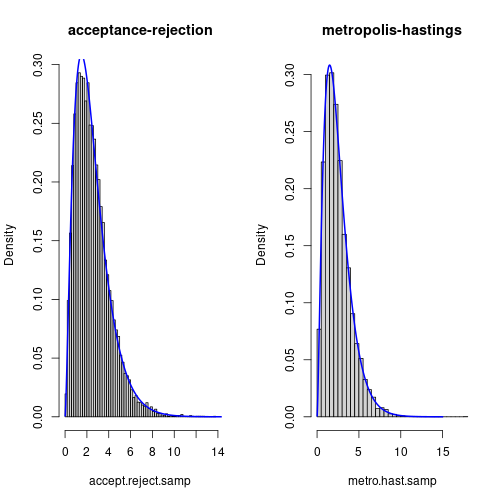
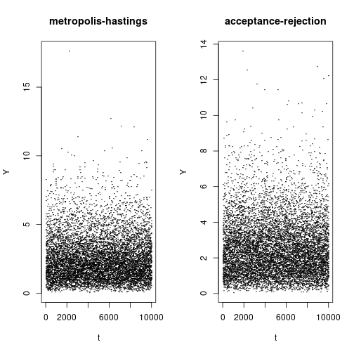
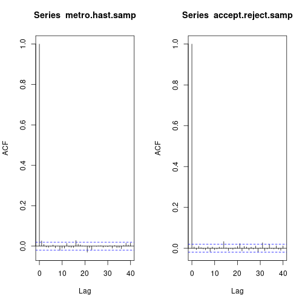
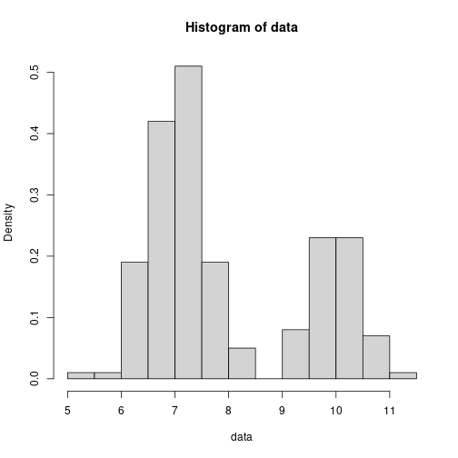
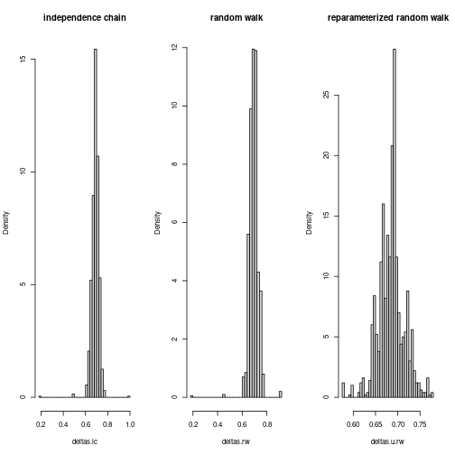
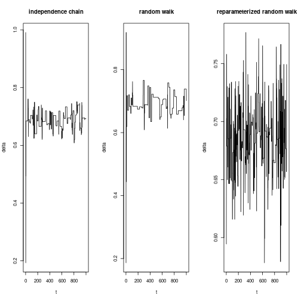
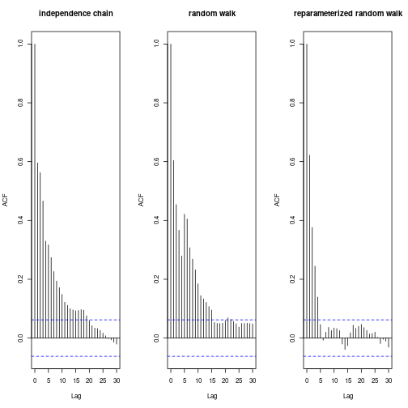
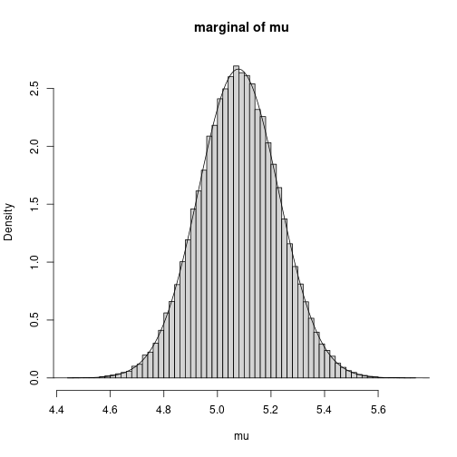
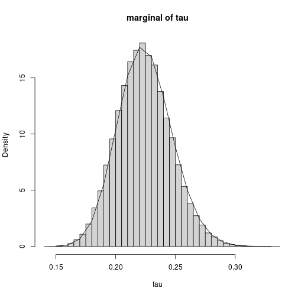

# Problem 1

Use Metropolis Hasting algorithm to generate $Y \sim \mathrm{Gamma}(\alpha, 1)$, where $\alpha > 1$. Note $\alpha$ need not to be an integer. Consider the proposal distribution $g$, which is the density of $\mathrm{GAM}(a,b)$, where $a=\lfloor \alpha \rfloor$ and $b = a/\alpha$.

---

## Part (a)

Implement your accept-reject algorithm and Metropolis-hastings algorithms to get a sample of $10000$ from $Y \sim \mathrm{Gamma}(\alpha=2.5,1)$.

---

### Acceptance-rejection sampler

We implement the density and sampler functions, respectively $\mathrm{dgamma1}$
and $\mathrm{rgamma1}$.

Suppose $X \sim \mathrm{Gamma}(\alpha,\beta)$ where $\alpha$ is the shape parameter
and $\beta$ is the rate parameter.
Then, $X$ has a density given by
$$
  f_X(x) = \frac{\beta^\alpha}{\Gamma(\alpha)} x^{\alpha-1} e^{-\beta x}.
$$

Suppose $Y \sim \mathrm{Gamma}(\alpha,1)$, $\alpha \geq 1$.
This is hard to sample from.
However, $Z \sim \mathrm{Gamma}(a,b)$ where $a = \lfloor \alpha \rfloor$ and
$b = a / \alpha$, is easy to sample from, since
$$
  Z = \sum_{i=1}^{a} X_i \sim \mathrm{Gamma}(a,b)
$$
where $X_i \sim \mathrm{Exponential}(b)$.

We may thus use acceptance-rejection sampling to sample $z \sim f_Z$ and then
$u \sim U(0,1)$ and accept $z$ as a realization from $f_Y$ if
$u \leq \frac{f_Y(z)}{c f_Z(z)}$ where, optimally,
$$
  c = \max_y \left\{\frac{f_Y(y)}{f_Z(y)}\right\},
$$
but in general $c$ must only satisfy $f_Y(y) / c f_Z(y) \leq 1$.

Note that we may use their respective kernels instead,
since the ratio of the kernels is proportional to $f_Y(y)/f_Z(y)$.
The ratio of the kernels is $h(y) = y^{\alpha-a} e^{(b-1)x}$.
Thus, we seek $c = \max_y h(y)$ which may be obtained by solving for the input
$y^*$ that maximizes $\log h$, which is the stationary point
$$
  \frac{d}{dy}\log h(y)\Bigr|_{y = y^*} = 0,
$$
and then substituting that into the ratio and simplifying, yielding the result
$$
  c = h(y^*) = (\alpha/e)^{\alpha-\lfloor \alpha \rfloor}.
$$
Observe that if $\alpha$ is an integer, then $c = 1$ and $h(y) = 1$, in which
case the target distribution and the candidate distribution are identical.

We implement the acceptance-rejection algorithm with the following code:

``` r
# The density function for random variates in the family
# GAM(shape=alpha,rate=1)
dgamma1 <- function(x, alpha) {
    dgamma(x, shape = alpha, rate = 1)
}

# An acceptance-rejection sampling procedure for random variates in the family
# GAM(shape=alpha,rate=1)
accept.reject.rgamma1 <- function(n, alpha) {
    a <- floor(alpha)
    rate <- a/alpha
    q <- (alpha/exp(1))^(a - alpha)
    ys <- vector(length = n)
    for (i in 1:n) {
        repeat {
            y <- sum(rexp(a, rate))  # draw candidate
            if (runif(1) <= q * y^(alpha - a) * exp(y * a/alpha - y)) {
                ys[i] <- y
                break
            }
        }
    }
    ys
}
```

We sample from $\mathrm{Gamma}(2.5,1)$ with the the acceptance-rejection method
with:

``` r
alpha <- 2.5
m <- 10000
accept.reject.samp <- accept.reject.rgamma1(m, alpha)
```

### Metropolis-Hastings algorithm

Here is our implementation of the Metropolis-Hastings algorithm:

``` r
# A sampling procedure for random variates in the family
# GAM(shape=alpha,rate=1) using Metropolis-Hastings algorithm
metro.hast.rgamma1 <- function(n, alpha, burn = 0) {
    a <- floor(alpha)
    rate <- a/alpha

    # density for random variates in the family GAM(shape=alpha,rate=1)
    f <- function(x) {
        dgamma(x, shape = alpha, rate = 1)
    }
    g <- function(x) {
        dgamma(x, shape = a, rate = rate)
    }

    m <- n + burn
    ys <- vector(length = m)
    ys[1] <- sum(rexp(a, rate))

    for (i in 2:m) {
        v <- sum(rexp(a, rate))  # draw from g
        u <- ys[i - 1]
        R <- f(v) * g(u)/(f(u) * g(v))
        if (runif(1) <= R) {
            ys[i] <- v
        } else {
            ys[i] <- u
        }
    }
    ys[(burn + 1):m]
}
```

We sample from the Metro-Hastings algorithm with the following code:

``` r
metro.hast.samp <- metro.hast.rgamma1(m, alpha)
```

---

## Part (b)

Check on mixing and convergence using plots. Run multiple chain and compute the
Gelman-Rubin statistics. You may pick any reasonable burn-in.

---

We plot the histograms with:

``` r
par(mfrow = c(1, 2))
hist(accept.reject.samp, freq = F, breaks = 50, main = "acceptance-rejection")
lines(seq(0.01, 15, by = 0.01), dgamma1(seq(0.01, 15, by = 0.01), alpha), col = "blue",
    lwd = 2)

hist(metro.hast.samp, freq = F, breaks = 50, main = "metropolis-hastings")
lines(seq(0.01, 15, by = 0.01), dgamma1(seq(0.01, 15, by = 0.01), alpha), col = "blue",
    lwd = 2)
```



Both samplers seem to be compatible with the density.

We plot the \emph{sample path} of the Metropolis-Hastings and acceptance-rejection
samplers with:

``` r
par(mfrow = c(1, 2))
plot(metro.hast.samp, pch = "·", xlab = "t", ylab = "Y", main = "metropolis-hastings")
plot(accept.reject.samp, pch = "·", xlab = "t", ylab = "Y", main = "acceptance-rejection")
```



Both of these look good, as neither remain at or near the same value for 
many iterations. They also both quickly move away from their initial values.

We plot the ACFs with:

``` r
par(mfrow = c(1, 2))
acf(metro.hast.samp)
acf(accept.reject.samp)
```



Both samplers seem to have very little autocorrelation.
If an uncorrelated sample is extremely important, to be
safe, taking every other sample point would probably be sufficient.

We implement the Gelman-Rubin statistic with:

``` r
# samps: should be an L x J matrix, where L is the length of the samples and J
# is the number of samples (independent chains).
gelman.rubin <- function(samps) {
    L <- nrow(samps)
    J <- ncol(samps)
    x.bar <- apply(samps, 2, mean)
    B <- var(x.bar) * L
    W <- mean(apply(samps, 2, var))

    ((L - 1)/L * W + B/L)/W
}
```

Next, we compute Gelman-Rubin statistics on the computed independence chains.

``` r
chains <- 1000
samps <- matrix(nrow = m, ncol = chains)
for (i in 1:chains) {
    samps[, i] <- metro.hast.rgamma1(m, alpha, burn = 1000)
}

gelman.rubin.stat <- gelman.rubin(samps)
print(gelman.rubin.stat)
```

```
## [1] 1.000007
```

We see that the Gelman-Rubin statistic is given by
$$
  R = 1.0000065.
$$

We adopt the rule of thumb that if $\sqrt{R} < 1.1$, the burn-in and chain
length are sufficient. We compute $\sqrt{R}$ to be
$$
  \sqrt{R} = 1.0000033,
$$
and thus are satisfied with our burn-in choice and chain length.

---

## Part (c)

Estimate $E(Y^2)$ using the generated chain. Compare with the estimate you get with acceptance-rejection sampling (Exam 1).

---

Theoretically,
$$
  E(Y^2) = \frac{\Gamma(2+\alpha)}{\Gamma(\alpha)} = \frac{\Gamma(4.5)}{\Gamma(2.5)} = 8.75.
$$

We estimate $E(Y^2)$ using the acceptance-rejection and Metropolis-Hastings
by taking the square of each element in the samples they generated and then taking
the mean:

``` r
tab <- matrix(nrow = 2, ncol = 1)
rownames(tab) <- c("acceptance-rejection", "metropolis-hastings")
colnames(tab) <- c("mean")
tab[1] <- c(mean(accept.reject.samp^2))
tab[2] <- c(mean(metro.hast.samp^2))

knitr::kable(data.frame(tab))
```


|                     |     mean|
|:--------------------|--------:|
|acceptance-rejection | 8.879713|
|metropolis-hastings  | 8.747732|
Both are quite close to the true value of $8.75$.


# Problem 2 (Problem 7.1)

Rework the textbook example. Consider the mixture normal $\delta N(7,0.5^2) + (1-\delta) N(10,0.5^2)$.

---

## Part (a)

Simulate $200$ realizations from the mixture distribution with $\delta = 0.7$.
Draw a histogram of these data.

---

We implement the density and sampler for the mixture distribution with:

``` r
dmix <- function(x, delta) {
    delta * dnorm(x, 7, 0.5) + (1 - delta) * dnorm(x, 10, 0.5)
}

rmix <- function(n, delta) {
    xs <- vector(length = n)
    for (i in 1:n) {
        xs[i] <- ifelse(runif(1) < delta, rnorm(1, 7, 0.5), rnorm(1, 10, 0.5))
    }
    xs
}
```

We generate a sample and plot its histogram with:

``` r
n <- 200
delta <- 0.7
data <- rmix(n, delta)
hist(data, freq = F)
```



---

## Part (b)

Now assume $\delta$ is unknown. Implement independence chain MCMC procedure to
simulate from the posterior distribution of $\delta$, using your data from
part (a).

---


``` r
lmix <- Vectorize(function(delta, xs) {
    if (delta < 0 || delta > 1) {
        return(0)
    }
    p <- 1
    for (x in xs) {
        p <- p * dmix(x, delta)
    }
    p
}, "delta")

logmix <- Vectorize(function(delta, xs) {
    if (delta < 0 || delta > 1) {
        return(-Inf)
    }
    logp <- 0
    for (x in xs) {
        logp <- logp + log(dmix(x, delta))
    }
    logp
}, "delta")
```

A sample $\{x_t\}$ drawn from the mixture normal with density $\mathrm{dmix}$
is observed with likelihood $\mathrm{lmix}(\delta|\vec{x})$ with respect to
$\delta$ with prior distribution $p(\delta)$.
Thus, the posterior distribution is given by
$$
  p(\delta|\vec{x}) \propto p(\delta) \mathrm{lmix}(\delta|\vec{x}).
$$

In the independence chain MCMC, we may use the prior as the proposal density,
$f(\delta) = p(\delta|\vec{x})$ and $g = p$,
and thus
$$
  R = \frac{f(\delta^{*}) g(\delta^{(t)})}{f(\delta^{(t)})g(\delta^{*})} = \frac{p(\delta^{*}|\vec{x}) p(\delta^{(t)})}{p(\delta^{(t)}|\vec{x}) p(\delta^{*})}
$$
which may be rewritten as
$$
  R = \frac{p(\delta^{*}) \mathrm{lmix}(\delta^{*}|\vec{x}) p(\delta^{(t)})}{p(\delta^{(t)}) \mathrm{lmix}(\delta^{(t)}|\vec{x}) p(\delta^{*})} = \frac{\mathrm{lmix}(\delta^{*}|\vec{x})}{\mathrm{lmix}(\delta^{(t)}|\vec{x})}.
$$

### Numerical imprecision
Suppose we have a data type $T$ that models real numbers.
Since computers are physical, $T$ can only represent a finite set of numbers.

In the likelihood function,
$$
  \mathrm{lmix} \colon \mathbb{R} \times 2^{\mathbb{R}} \mapsto \mathbb{R},
$$
if we model $\mathbb{R}$ with $T$, i.e.,
$$
  \mathrm{lmix} \colon T \times 2^T \mapsto T,
$$
then if the true value of the likelihood function applied to a sufficiently
large sample is some value $p \in (0,\epsilon)$ where $\epsilon$ is the smallest
representable positive number of type $T$, the best we can do is round $p$
to $0$ or $\epsilon$.
As a consequence, the likelihood function evaluates to $0$ on any sufficiently
large sample size.

Suppose $\epsilon = 2^{-K}$.
If we use the log-likelihood instead,
$$
  \mathrm{logmix} \colon T \times 2^T \mapsto T
$$
then, for instance, $\log_2 \epsilon = -K$ where $-K$ is very likely to be at
least approximately representatable by $T$, and much smaller values as well.
We cannot map many of these log-likelihoods back to a likelihood, but as long
as we only need to work with log-likelihoods, this is not a problem.

With the above in mind, we replace the likelihood function with the
log-likelihood function to significantly increase the space of samples we can
work with.


``` r
delta.estimator.ic <- function(n, data, delta0 = runif(1), burn = 0) {
    m <- n + burn
    deltas <- vector(length = m)
    deltas[1] <- delta0

    for (i in 2:m) {
        delta <- runif(1)  # draw candidate from prior
        delta.old <- deltas[i - 1]
        log.R <- logmix(delta, data) - logmix(delta.old, data)
        if (log(runif(1)) <= log.R) {
            deltas[i] <- delta
        } else {
            deltas[i] <- delta.old
        }
    }
    deltas[(burn + 1):m]
}
```

---

## Part (c)

Implement a random walk chain with $\delta^* = \delta^{(t)} + \epsilon_t$ with
$\epsilon \sim \mathrm{Uniform}(-1,1)$.

---

We observe that $\epsilon_t \sim \mathrm{Uniform}(-1,1)$ for $t=0,\ldots,t$
are the only random components. Thus, the conditional distribution of
$\epsilon_{t+1}$ given $\epsilon_{t}$ is
$$
  \epsilon_{t+1} \sim f(\delta^* - \delta^{(t)})
$$
where $f$ is the density of $\mathrm{Uniform}(-1,1)$.


``` r
delta.estimator.rw <- function(n, data, delta0 = runif(1), burn = 0) {
    m <- n + burn
    deltas <- vector(length = m)
    deltas[1] <- delta0
    for (i in 2:m) {
        delta.old <- deltas[i - 1]
        delta <- delta.old + runif(1, -1, 1)
        log.R <- logmix(delta, data) - logmix(delta.old, data)
        if (log(runif(1)) <= log.R) {
            deltas[i] <- delta
        } else {
            deltas[i] <- delta.old
        }
    }
    deltas[(burn + 1):m]
}
```

---

## Part (d)

Reparameterize the problem letting $U = \log\left(\delta/(1-\delta)\right)$ and $U^* = u(t) + \epsilon_t$. Implement a random walk chain with $U$ as in Equation (7.8) page 208.

---


``` r
logit <- function(delta) {
    log(delta/(1 - delta))
}
logit.inv <- function(u) {
    exp(u)/(1 + exp(u))
}
logit.inv.J <- function(u) {
    exp(u)/(1 + exp(u))^2
}

delta.estimator.u.rw <- function(n, data, delta0 = runif(1), burn = 0) {
    m <- n + burn
    u <- vector(length = m)
    u[1] <- logit(delta0)
    for (i in 2:m) {
        u.old <- u[i - 1]
        u.star <- u.old + runif(1, -1, 1)
        R <- lmix(logit.inv(u.star), data) * logit.inv.J(u.star)/(lmix(logit.inv(u.old),
            data) * logit.inv.J(u.old))
        if (runif(1) <= R) {
            u[i] <- u.star
        } else {
            u[i] <- u.old
        }
    }
    logit.inv(u[(burn + 1):m])
}
```

---

## Part (e)

Compare the estimates and convergence behavior of three algorithms.

---

We do not do a burn-in, since we are interested in seeing how quickly the three methods converge. We only plot chains of length $1000$.

We generate the data sets with:

``` r
chain <- 1000
burn <- 0
deltas.ic <- delta.estimator.ic(chain, data, burn = burn)
deltas.rw <- delta.estimator.rw(chain, data, burn = burn)
deltas.u.rw <- delta.estimator.u.rw(chain, data, burn = burn)
tab <- matrix(nrow = 3, ncol = 1)
rownames(tab) <- c("independence chain", "random walk", "reparameterized random walk")
colnames(tab) <- c("mu")
tab[1, ] <- mean(deltas.ic)
tab[2, ] <- mean(deltas.rw)
tab[3, ] <- mean(deltas.u.rw)
knitr::kable(data.frame(tab))
```


|                            |   $\mu$  |
|:---------------------------|---------:|
|independence chain          | 0.6886690|
|random walk                 | 0.6935625|
|reparameterized random walk | 0.6854366|

As the table of estimations shows, all three methods provide a good estimate of $\delta$. Next, we consider their convergence and mixing behavior.

We plot the histograms with:

``` r
par(mfrow = c(1, 3))
hist(deltas.ic, freq = F, breaks = 50, main = "independence chain")
hist(deltas.rw, freq = F, breaks = 50, main = "random walk")
hist(deltas.u.rw, freq = F, breaks = 50, main = "reparameterized random walk")
```



The reparameterized random walk metropolis has a histogram that is most compatible with normality, i.e., characteristic bell curve with a mode at $\delta = 0.7$.
That said, all three histograms arguably satisfy normality with approximately the same mean at $\delta = 0.7$.

We plot the sample paths with:

``` r
par(mfrow = c(1, 3))
plot(deltas.ic, pch = "·", type = "l", xlab = "t", ylab = "delta", main = "independence chain")
plot(deltas.rw, pch = "·", type = "l", xlab = "t", ylab = "delta", main = "random walk")
plot(deltas.u.rw, pch = "·", type = "l", xlab = "t", ylab = "delta", main = "reparameterized random walk")
```



We see that the random walk demonstrates relatively poor mixing. It has a high rejection rate (stays at the same level for long periods of time), causing it to explore the support of the likelihood slowly.

The sample path of the indepedence chain also can be said to demonstrate poor mixing.

The reparameterized random walk exihibits good mixing, vigorously jiggling around the true value.

We plot the ACFs with:

``` r
par(mfrow = c(1, 3))
acf(deltas.ic, main = "independence chain")
acf(deltas.rw, main = "random walk")
acf(deltas.u.rw, main = "reparameterized random walk")
```



They all decay quickly, but in order of increasing
autocorrelation: the reparameterized random walk, the independence chain, and the random walk.

In particular, the reparameterized random walk shows autocorrelation that decays quite rapidly with respect to lag time.

# Problem 3
Consider an i.i.d. sample $X_1,\ldots,X_n$ from $N(\mu,\sigma^2)$. Consider the Bayesian analysis to estimate $\mu$ and $\tau = (\sigma^2)^{-1}$. We put prior $\mu \sim N(m,p^{-1})$ and $\tau \sim \mathrm{Gamma}(a,b)$.

---

## Part (a)

Write out the posterior distribution of $(\mu,\tau)|\vec{x}$. You may ignore the normalizing constant.

---

Note that the posterior distribution is given by
$$
  \pi(\mu,\tau|\vec{x}) = f(\vec{x}|\tau,\mu)f(\tau)f(\mu) / Z
$$
where $Z = f(\vec{x})$ is the normalizing constant.
We may rewrite this as
$$
  \pi(\mu,\tau|\vec{x}) \propto L(\tau,\mu|\vec{x})f(\tau)f(\mu).
$$

The likelihood function of $(\mu,\tau)$ conditioned on the data $\vec{x}$
is given by the product of the normal density on the sample,
$$
  L(\mu,\tau|\vec{x}) = \prod_{i=1}^{n} \frac{1}{\sqrt{2 \pi \sigma^2}} \exp\left\{-\frac{1}{2 \sigma^2}(x_i-\mu)^2\right\}
$$
which may be simplified to
$$
  L(\mu,\tau|\vec{x}) = \left(2 \pi \sigma^2\right)^{-n/2} \exp\left\{-\frac{1}{2\sigma^2}\sum_{i=1}^{n}(x_i-\mu)^2\right\}.
$$
Observing $\tau = 1/\sigma^2$, we obtain the result
$$
  L(\mu,\tau|\vec{x}) \propto \tau^{n/2} \exp\left\{-\frac{\tau}{2}\sum_{i=1}^{n}(x_i-\mu)^2\right\}.
$$
The prior for $\mu$ is $f(\mu) \propto \exp\left(-\frac{p}{2}(\mu - m)^2\right)$ and the prior for $\tau$ is $f(\tau) \propto \tau^{a-1} \exp(-b \tau)$.
Putting it all together, we obtain the result
$$
  \pi(\mu,\tau|\vec{x}) \propto \tau^{n/2+a-1} \exp\left\{-\frac{\tau}{2}\sum_{i=1}^{n}(x_i-\mu)^2-\frac{p}{2}(\mu - m)^2 - b \tau\right\}.
$$

---

## Part (b)
Show the posterior conditional distribution of $\mu|(\tau,\vec{x})$ is
$$
  N\left(\frac{n \tau \bar{x} + p m}{ n \tau + p}, \frac{1}{n \tau + p}\right)
$$
and the posterior conditional distribution of $\tau|(\mu,\vec{x})$ is
$$
  \mathrm{GAM}\!\left(a+n/2,b+n/2[s^2+(u -\bar{x})^2]\right).
$$
---

### Distribution of $\mu|(\tau,\vec{x})$

The conditional distribution of $\mu|(\tau,\vec{x})$ is given by
$$
  \pi(\mu | \tau,\vec{x}) = \frac{\pi(\mu,\tau|\vec{x})}{\pi(\tau|\vec{x})}
$$
where
$$
  \pi(\tau|\vec{x}) = \int_{-\infty}^{\infty} \pi(\mu,\tau|\vec{x}) d\mu.
$$
Note that $\pi(\tau|\vec{x})$ is not a function of $\mu$, and thus
$$
  \pi(\mu | \tau,\vec{x}) \propto \pi(\mu,\tau|\vec{x}).
$$
We discard any factor that is not a function of $\mu$,
$$
  \pi(\mu | \tau,\vec{x}) \propto \exp\left\{-\frac{\tau}{2}\sum_{i=1}^{n}(x_i-\mu)^2\right\} \exp\left(-\frac{p}{2}(\mu - m)^2\right).
$$

Now, we wish to show that this is the kernel of the given normal distribution.
We do this by discarding any factors that are not a function of $\mu$ and
rewriting the result that fits the pattern of a normal kernel
$$
  \pi(\mu | \tau,\vec{x}) = \exp\left\{-\frac{1}{2 k_1}\left(\mu - k_2\right)^2\right\}
$$
with a mean $k_2$ and variance $k_1$.

$$
\begin{align*}
  \pi(\mu | \tau,\vec{x})
    &\propto \exp\left\{-\frac{\tau}{2}\left[\sum x_i^2 - 2 \mu \sum x_i + n \mu^2\right] - \frac{p}{2}\left[\mu^2 - 2\mu m + m^2\right]\right\}\\
    &\propto \exp\left\{-\frac{1}{2}\left[- 2 n \tau \bar{x}\mu + n \tau \mu^2 + p \mu^2 - 2 p m \mu\right]\right\}\\
    &\propto \exp\left\{-\frac{1}{2}\left[(n \tau + p)\mu^2 - (2 p m + 2 n \tau \bar{x})\mu\right]\right\}\\
    &\propto \exp\left\{-\frac{n \tau + p}{2}\left[\mu^2 - \frac{2(p m + n \tau \bar{x})}{n \tau + p}\mu\right]\right\}.
\end{align*}
$$

Completing the square, we obtain
$$
\begin{align*}
  \pi(\mu | \tau,\vec{x})
    &\propto \exp\left\{-\frac{n \tau + p}{2}\left[\mu - \frac{p m + n \tau \bar{x}}{n \tau + p}\right]^2 - \left[\frac{p m + n \tau \bar{x}}{n \tau + p}\right]^2\right\}\\
    &\propto \exp\left\{-\frac{n \tau + p}{2}\left[\mu - \frac{p m + n \tau \bar{x}}{n \tau + p}\right]^2\right\}.
\end{align*}
$$

Thus, we see that this is the kernel of a normal density with mean
$$
  \frac{p m + n \tau \bar{x}}{n \tau + p}
$$
and variance
$$
  \frac{1}{n\tau + p}.
$$

### Distribution of $\tau|(\mu,\vec{x})$

The conditional distribution of $\tau|(\mu,\vec{x})$ is given by
$$
  \pi(\tau | \mu,\vec{x}) = \frac{\pi(\mu,\tau|\vec{x})}{\pi(\mu|\vec{x})}
$$
where
$$
  \pi(\mu|\vec{x}) = \int_{-\infty}^{\infty} \pi(\mu,\tau|\vec{x}) d\tau.
$$
Note that $\pi(\mu|\vec{x})$ is not a function of $\tau$, and thus
$$
  \pi(\tau | \mu,\vec{x}) \propto \pi(\mu,\tau|\vec{x}).
$$
We discard any factor that is not a function of $\tau$,
$$
  \pi(\tau | \mu,\vec{x}) \propto \tau^{n/2+a-1} \exp\left\{-\frac{\tau}{2}\sum_{i=1}^{n}(x_i-\mu)^2 - b \tau \right\}.
$$

We seek to match it to the kernel of the gamma density for $\mathrm{GAM}(\alpha,\beta)$,
which is given by
$$
  \tau^{\alpha-1}\exp(-\beta \tau).
$$
So, we rewrite the above as
\begin{align}
  \pi(\tau | \mu,\vec{x})
    &\propto \tau^{n/2+a-1} \exp\left\{-\frac{\tau}{2}\sum(x_i-\mu)^2 - b \tau \right\}\\
    &\propto \tau^{n/2+a-1} \exp\left\{-\left(\frac{1}{2}\sum(x_i-\mu)^2 + b\right) \tau \right\}.
\end{align}
Thus, we see that $\alpha = n/2+a$ and $\beta = b + \frac{1}{2}\sum(x_i-\mu)^2$.
The $\beta$ is not in the form requested, so we continue, focusing strictly on $\beta$.

We may rewrite $\sum(x_i-\mu)^2$ as

$$
\begin{align*}
  \sum(x_i-\mu)^2 &= \sum(x_i- \bar{x} + \bar{x} - \mu)^2\\
                  &= \sum(x_i- \bar{x})^2 + \sum(\bar{x} - \mu)^2 - 2 \sum(x_i - \bar{x})(\bar{x} - \mu)\\
                  &= \sum(x_i- \bar{x})^2 + n(\bar{x} - \mu)^2 - 2 \left(\sum x_i  - n \bar{x}\right)(\bar{x} - \mu).
\end{align*}
$$

Since $\sum x_i  - n \bar{x} = 0$, we may drop the last term,
$$
  \sum(x_i-\mu)^2 = \sum(x_i- \bar{x})^2 + n(\bar{x} - \mu)^2.
$$

We note that $s^2 = \frac{1}{n}\sum(x_i - \bar{x})^2$ and thus
$$
  \sum(x_i-\mu)^2 = n(s^2 + (\mu-\bar{x})^2),
$$
which shows that $\beta = b + \frac{n}{2}(s^2 + (\mu-\bar{x})^2)$ and $\alpha = n/2+a$ and is thus the kernel of
$$
  \mathrm{Gamma}\!\left(n/2+a,b + n(s^2 + (\mu-\bar{x})^2)/2\right).
$$

---

## Part (c)

First, generate some ``observed'' sample data using $x = rnorm(200,mu=5,sigma=2)$. Hand-code Gibbs Sampler algorithm to sample $(\mu,\tau)$ from the posterior using $x$. You make take prior parameters $a = 0.0001; b = 0.0001; p = 0.0001; m = 0$. Use the estimated posterior mean and compare your estimates with the true parameters $\mu = 5$ and $\tau = 0.25$.

---

We generate the sample with:

``` r
x <- rnorm(200, mean = 5, sd = 2)
```

We implement the Gibbs sampling with the function:

``` r
mu.tau.gibbs <- function(n, x, burn = 1000, theta0 = NULL, p = 1e-04, m = 0, a = 1e-04,
    b = 1e-04) {
    x.mu <- mean(x)
    x.s2 <- var(x)
    x.n <- length(x)

    rmu <- function(tau) {
        mean <- (x.n * tau * x.mu + p * m)/(x.n * tau + p)
        var <- 1/(x.n * tau + p)
        rnorm(1, mean = mean, sd = sqrt(var))
    }

    rtau <- function(mu) {
        rgamma(1, shape = a + x.n/2, rate = b + x.n * (x.s2 + (mu - x.mu)^2)/2)
    }

    prior <- function() {
        c(rnorm(1, m, 1/p), rgamma(1, a, b))
    }

    N <- n + burn
    thetas <- matrix(nrow = N, ncol = 2)
    if (is.null(theta0)) {
        thetas[1, ] <- prior()
    } else {
        thetas[1, ] <- theta0
    }

    for (i in 1:(N - 1)) {
        tau.new <- rtau(thetas[i, 1])
        mu.new <- rmu(tau.new)
        thetas[i + 1, ] <- c(mu.new, tau.new)
    }

    thetas <- thetas[(burn + 1):N, ]
    mu.est <- mean(thetas[, 1])
    tau.est <- mean(thetas[, 2])
    sigma.est <- sqrt(1/tau.est)
    list(theta.dist = thetas, mu.est = mu.est, tau.est = tau.est, sigma.est = sigma.est)
}
```

We use the Gibbs sampler to estimate $(\mu,\tau)$ with:

``` r
# set up hyper-parameters
a <- 1e-04
b <- 1e-04
m <- 0
p <- 1e-04

res <- mu.tau.gibbs(1e+05, x, burn = 10000, p = p, a = a, m = m, b = b)
mu.est <- round(as.numeric(res$mu.est), digits = 4)
tau.est <- round(as.numeric(res$tau.est), digits = 4)
var.est <- round(1/tau.est, digits = 4)
c(mu.est, tau.est)
```

```
## [1] 5.0791 0.2236
```

We estimate $(\mu,\tau)$ to be $(5.0791, 0.2236)'$.
Therefore, we estimate that the data is being sampled from the normal
distribution
\begin{equation}
  X_i \sim N(\mu=5.0791,\sigma^2=4.4723).
\end{equation}

## Additional analysis
Out of curiosity, we decided to plot the marginals of the sample superimposed
with their respective conditional densities with:

``` r
x.mu <- mean(x)
x.n <- length(x)
x.s2 <- var(x)
mu.dist <- res$theta.dist[, 1]
tau.dist <- res$theta.dist[, 2]

hist(mu.dist, freq = F, breaks = 50, main = "marginal of mu", xlab = "mu")
lines(seq(4, 6, by = 0.01), dnorm(seq(4, 6, by = 0.01), mean = (x.n * tau.est * x.mu)/(x.n *
    tau.est + p), sd = sqrt(1/(x.n * tau.est + p))))
```



``` r
hist(tau.dist, freq = F, breaks = 50, main = "marginal of tau", xlab = "tau")
lines(seq(0.15, 0.4, by = 0.01), dgamma(seq(0.15, 0.4, by = 0.01), shape = a + x.n/2,
    rate = b + x.n * (x.s2 + (mu.est - x.mu)^2)/2))
```



